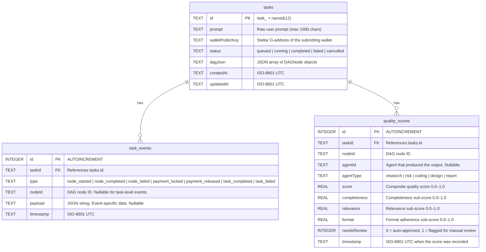
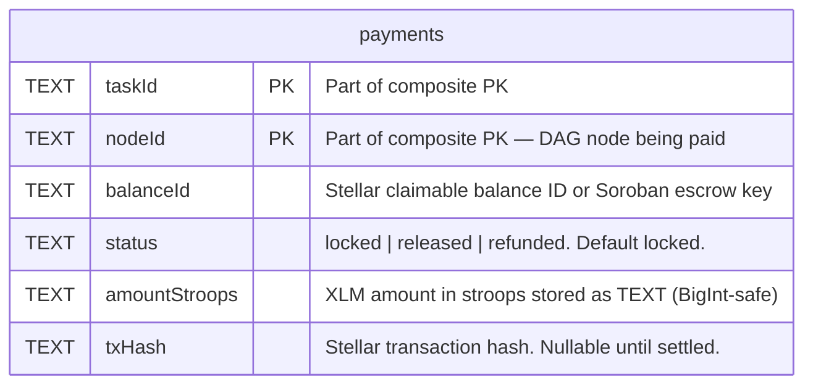

# Database Schema

Complete reference for ai-net's three SQLite databases: `agents.db`, `tasks.db`, and `payments.db`.

---

## Table of Contents

1. [Overview](#1-overview)
2. [agents.db](#2-agentsdb)
   - [ER Diagram](#21-er-diagram)
   - [Table: agents](#22-table-agents)
   - [Indexes](#23-indexes)
3. [tasks.db](#3-tasksdb)
   - [ER Diagram](#31-er-diagram)
   - [Table: tasks](#32-table-tasks)
   - [Table: task_events](#33-table-task_events)
   - [Table: quality_scores](#34-table-quality_scores)
   - [Indexes](#35-indexes)
4. [payments.db](#4-paymentsdb)
   - [ER Diagram](#41-er-diagram)
   - [Table: payments](#42-table-payments)
   - [Indexes](#43-indexes)
5. [Schema Migrations](#5-schema-migrations)
   - [How Migrations Work](#51-how-migrations-work)
   - [Running Migrations](#52-running-migrations)
   - [Writing a New Migration](#53-writing-a-new-migration)
   - [Rolling Back](#54-rolling-back)
   - [Seeding for Local Development](#55-seeding-for-local-development)
   - [Handling Schema Conflicts in Team Environments](#56-handling-schema-conflicts-in-team-environments)

---

## 1. Overview

The backend uses three separate SQLite databases, each owning a bounded domain:

| Database | File | Domain |
|---|---|---|
| `agents.db` | `<cwd>/agents.db` | Agent registrations, capabilities, pricing, reputation |
| `tasks.db` | `<cwd>/tasks.db` | Tasks, DAG state, execution events, quality scores |
| `payments.db` | `<cwd>/payments.db` | Escrow payment records and settlement status |

Each database:
- Is opened via a connection pool (`min: 1, max: 4 connections`) defined in `backend/src/db/pool.ts`
- Runs its own schema migration sequence via the shared `backend/src/db/migrator.ts` runner
- Maintains a `schema_migrations` ledger table tracking applied versions and checksums
- Starts automatically on first use — no manual `CREATE TABLE` required

When running with Docker Compose, all three files reside inside the `sqlite_data` named volume mounted at `/app/data/`.

---

## 2. agents.db

### 2.1 ER Diagram

```mermaid
erDiagram
  agents {
    TEXT id PK "Agent unique identifier (e.g. agent-research-001)"
    TEXT capabilities "JSON array of capability strings (e.g. [\"research\",\"risk\"])"
    REAL pricingXLM "Price per task execution in XLM"
    TEXT endpoint "HTTP URL where the agent accepts subtask requests"
    TEXT stellarPublicKey "Stellar account G-address for payment receipt"
    REAL reputationScore "Score 0.0–5.0. Default 2.5. Clamped on update."
    TEXT lastSeenAt "ISO-8601 UTC timestamp of last heartbeat"
    TEXT status "\"online\" | \"offline\". Default \"online\"."
    REAL bondAmountXLM "XLM staked as security bond. Default 0."
    INTEGER tasksCompleted "Successful task count. Default 0."
    INTEGER tasksFailed "Failed task count. Default 0."
    TEXT lastActiveAt "ISO-8601 UTC timestamp of last task activity. Nullable."
  }
```

### 2.2 Table: `agents`

Stores the live registry of agents known to the backend. Seeded from the on-chain `agent_registry` Soroban contract via a 60-second background sync, and also updated directly by `POST /api/agents/register`.

```sql
CREATE TABLE IF NOT EXISTS agents (
  id               TEXT PRIMARY KEY,
  capabilities     TEXT NOT NULL,
  pricingXLM       REAL NOT NULL,
  endpoint         TEXT NOT NULL,
  stellarPublicKey TEXT NOT NULL,
  reputationScore  REAL NOT NULL DEFAULT 2.5,
  lastSeenAt       TEXT NOT NULL,
  status           TEXT NOT NULL DEFAULT 'online',
  bondAmountXLM    REAL NOT NULL DEFAULT 0,
  tasksCompleted   INTEGER NOT NULL DEFAULT 0,
  tasksFailed      INTEGER NOT NULL DEFAULT 0,
  lastActiveAt     TEXT
);
```

**Column details**

| Column | Type | Nullable | Notes |
|---|---|---|---|
| `id` | `TEXT` | No | Agent's self-assigned identifier. Must be unique. |
| `capabilities` | `TEXT` | No | JSON-serialized string array. Use `json_each()` for filtering. Valid values: `research`, `risk`, `coding`, `design`, `report`. |
| `pricingXLM` | `REAL` | No | XLM charged per subtask execution. |
| `endpoint` | `TEXT` | No | Full HTTP URL. Must be reachable by the coordinator at dispatch time. |
| `stellarPublicKey` | `TEXT` | No | The Stellar G-address where payment is released after task completion. |
| `reputationScore` | `REAL` | No | Normalized 0.0–5.0. Updated by `updateReputation()` / `updateReputationWithStats()`. Write is clamped: `MAX(0.0, MIN(5.0, score + delta))`. |
| `lastSeenAt` | `TEXT` | No | ISO-8601 UTC string. Updated by heartbeat endpoint. Used by `markStaleAgents()` to set status `offline` after 5 minutes of silence. |
| `status` | `TEXT` | No | Enum: `'online'` or `'offline'`. |
| `bondAmountXLM` | `REAL` | No | Security bond held on-chain. Backend mirrors value for UI display. |
| `tasksCompleted` | `INTEGER` | No | Incremented on `outcome: 'success'` in `updateReputationWithStats()`. |
| `tasksFailed` | `INTEGER` | No | Incremented on `outcome: 'failure'` in `updateReputationWithStats()`. |
| `lastActiveAt` | `TEXT` | Yes | ISO-8601 UTC. `NULL` until the agent's first task. |

**Upsert behavior**

`agents.upsert()` uses `INSERT ... ON CONFLICT(id) DO UPDATE SET ...`. All columns except `reputationScore` are overwritten on conflict. Reputation is updated only through the dedicated `updateReputation*` methods to prevent a stale sync from overwriting an accumulated score.

### 2.3 Indexes

| Index | Columns | Rationale |
|---|---|---|
| `PRIMARY KEY` (implicit) | `id` | O(1) agent lookup by ID. Used by heartbeat, task assignment, and deregister. |
| None (capability filter) | `capabilities` via `json_each()` | Capability filtering scans the table but is bounded because the agent set is expected to be small (<10,000 rows). A functional index on `json_each(capabilities)` is tracked in [issue #32](https://github.com/Epta-Node/ai-net/issues/32). |

**Cursor-based pagination** — `listCursor()` uses a compound keyset `(lastSeenAt DESC, id DESC)` for stable pagination. No additional index is needed because SQLite uses the PK btree for the `id` component and the `lastSeenAt` column is always populated.

---

## 3. tasks.db

### 3.1 ER Diagram



### 3.2 Table: `tasks`

One row per user-submitted task. `dagJson` stores the full DAG structure (nodes and dependency edges) as a serialized JSON array.

```sql
CREATE TABLE IF NOT EXISTS tasks (
  id              TEXT PRIMARY KEY,
  prompt          TEXT NOT NULL,
  walletPublicKey TEXT NOT NULL DEFAULT '',
  status          TEXT NOT NULL DEFAULT 'queued',
  dagJson         TEXT NOT NULL DEFAULT '[]',
  createdAt       TEXT NOT NULL,
  updatedAt       TEXT NOT NULL
);
```

**Column details**

| Column | Type | Nullable | Notes |
|---|---|---|---|
| `id` | `TEXT` | No | Format: `task_` + 12-character nanoid. E.g. `task_xK9mPqRvLz2w`. |
| `prompt` | `TEXT` | No | The raw natural-language task description submitted by the user. |
| `walletPublicKey` | `TEXT` | No | Stellar G-address of the submitter. Used for access control on `/api/tasks` and WebSocket streams. |
| `status` | `TEXT` | No | Lifecycle: `queued` → `running` → `completed` \| `failed` \| `cancelled`. |
| `dagJson` | `TEXT` | No | Serialized `DAGNode[]`. Each `DAGNode` has: `{ id, taskType, dependsOn, assignedAgent?, status, result? }`. |
| `createdAt` | `TEXT` | No | ISO-8601 UTC. Set on `INSERT`. |
| `updatedAt` | `TEXT` | No | ISO-8601 UTC. Updated on every status change. |

### 3.3 Table: `task_events`

Append-only event log for DAG execution events. Consumed by the WebSocket stream endpoint to replay events to reconnecting clients and by the coordinator to persist audit logs.

```sql
CREATE TABLE IF NOT EXISTS task_events (
  id        INTEGER PRIMARY KEY AUTOINCREMENT,
  taskId    TEXT    NOT NULL,
  type      TEXT    NOT NULL,
  nodeId    TEXT,
  payload   TEXT,
  timestamp TEXT    NOT NULL
);

CREATE INDEX IF NOT EXISTS idx_task_events_taskId ON task_events (taskId);
```

**Column details**

| Column | Type | Nullable | Notes |
|---|---|---|---|
| `id` | `INTEGER` | No | Auto-incremented surrogate key. Defines canonical event order. |
| `taskId` | `TEXT` | No | Foreign key to `tasks.id`. Not enforced as FK constraint (SQLite FK pragma disabled for performance). |
| `type` | `TEXT` | No | Event type enum: `node_started`, `node_completed`, `node_failed`, `payment_locked`, `payment_released`, `task_completed`, `task_failed`. |
| `nodeId` | `TEXT` | Yes | Present for node-level events. `NULL` for task-level events (`task_completed`, `task_failed`). |
| `payload` | `TEXT` | Yes | JSON string with event-specific data (e.g. `{ "result": "...", "agentId": "..." }`). `NULL` for events with no payload. |
| `timestamp` | `TEXT` | No | ISO-8601 UTC when the event was emitted. |

### 3.4 Table: `quality_scores`

Records automated quality evaluation results for each agent node's output. The `qualityScorer` service calculates sub-scores for completeness, relevance, and format adherence. Rows with `needsReview = 1` are surfaced in the admin dashboard for manual inspection.

```sql
CREATE TABLE IF NOT EXISTS quality_scores (
  id           INTEGER PRIMARY KEY AUTOINCREMENT,
  taskId       TEXT    NOT NULL,
  nodeId       TEXT    NOT NULL,
  agentId      TEXT,
  agentType    TEXT    NOT NULL,
  score        REAL    NOT NULL,
  completeness REAL    NOT NULL,
  relevance    REAL    NOT NULL,
  format       REAL    NOT NULL,
  needsReview  INTEGER NOT NULL DEFAULT 0,
  timestamp    TEXT    NOT NULL
);

CREATE INDEX IF NOT EXISTS idx_quality_scores_agentId ON quality_scores (agentId);
```

**Column details**

| Column | Type | Nullable | Notes |
|---|---|---|---|
| `id` | `INTEGER` | No | Auto-incremented surrogate key. |
| `taskId` | `TEXT` | No | Identifies the parent task. |
| `nodeId` | `TEXT` | No | DAG node within the task. |
| `agentId` | `TEXT` | Yes | Agent that produced the output. `NULL` if the agent was not registered or if scored without an agent context. |
| `agentType` | `TEXT` | No | One of: `research`, `risk`, `coding`, `design`, `report`. |
| `score` | `REAL` | No | Composite score: `0.4 * completeness + 0.4 * relevance + 0.2 * format`. Range `0.0–1.0`. |
| `completeness` | `REAL` | No | Did the output cover all required points? Range `0.0–1.0`. |
| `relevance` | `REAL` | No | Is the output on-topic and accurate? Range `0.0–1.0`. |
| `format` | `REAL` | No | Does the output follow the expected format? Range `0.0–1.0`. |
| `needsReview` | `INTEGER` | No | Boolean flag. `1` when `score < 0.6`. |
| `timestamp` | `TEXT` | No | ISO-8601 UTC when the score was recorded. |

### 3.5 Indexes

| Index | Table | Columns | Rationale |
|---|---|---|---|
| `PRIMARY KEY` (implicit) | `tasks` | `id` | O(1) task lookup. |
| `idx_tasks_created_at` | `tasks` | `createdAt` | Powers `GET /api/tasks` sorted by creation time without a full scan. |
| `idx_task_events_taskId` | `task_events` | `taskId` | Efficiently fetches all events for a given task — used by WebSocket replay and audit queries. |
| `idx_quality_scores_agentId` | `quality_scores` | `agentId` | Powers per-agent reputation queries joining quality scores to reputation calculation. |

---

## 4. payments.db

### 4.1 ER Diagram



### 4.2 Table: `payments`

Tracks escrow payment state for every (task, node) pair. One row is inserted when escrow is locked and updated when payment is released to an agent or refunded to the coordinator.

```sql
CREATE TABLE IF NOT EXISTS payments (
  taskId        TEXT NOT NULL,
  nodeId        TEXT NOT NULL,
  balanceId     TEXT NOT NULL,
  status        TEXT NOT NULL DEFAULT 'locked',
  amountStroops TEXT NOT NULL,
  txHash        TEXT,
  PRIMARY KEY (taskId, nodeId)
);
```

**Column details**

| Column | Type | Nullable | Notes |
|---|---|---|---|
| `taskId` | `TEXT` | No | Part of composite primary key. References the parent task. |
| `nodeId` | `TEXT` | No | Part of composite primary key. Identifies the DAG node (and thus the agent) being compensated. |
| `balanceId` | `TEXT` | No | Identifier for the on-chain escrow entry. For Stellar claimable balances this is the balance ID; for Soroban escrow contracts it is the storage key. |
| `status` | `TEXT` | No | Lifecycle: `locked` → `released` \| `refunded`. Transitions are enforced by `updateStatus()`. |
| `amountStroops` | `TEXT` | No | XLM amount stored as a string representation of a `BigInt` (stroops = XLM × 10,000,000). Stored as `TEXT` to avoid SQLite `REAL` precision loss for large integers. |
| `txHash` | `TEXT` | Yes | Stellar transaction hash confirming settlement. `NULL` until `releasePayment` or `refundEscrow` confirms on-chain. |

**`amountStroops` precision note:** JavaScript's `Number` type loses precision for integers above 2^53. The payment layer uses `BigInt` internally and serializes to/from `TEXT` when persisting to avoid this. The application layer converts to XLM display strings only at the presentation boundary.

### 4.3 Indexes

| Index | Table | Columns | Rationale |
|---|---|---|---|
| `PRIMARY KEY` (implicit) | `payments` | `(taskId, nodeId)` | O(1) lookup by task + node. Prevents duplicate escrow entries per node. |
| `idx_payments_status` | `payments` | `status` | Powers the payment reconciliation background worker which polls for `status = 'locked'` rows older than a threshold to detect stuck escrows. |

---

## 5. Schema Migrations

### 5.1 How Migrations Work

Each database has its own migrations directory under `backend/src/db/migrations/`:

```
backend/src/db/migrations/
├── agents/
│   └── 001_create_agents_table.up.sql
│   └── 001_create_agents_table.down.sql
├── tasks/
│   ├── 001_create_tasks_table.up.sql
│   ├── 001_create_tasks_table.down.sql
│   ├── 002_create_task_events_table.up.sql
│   ├── 002_create_task_events_table.down.sql
│   ├── 003_create_quality_scores_table.up.sql
│   ├── 003_create_quality_scores_table.down.sql
│   ├── 004_add_created_at_index.up.sql
│   └── 004_add_created_at_index.down.sql
└── payments/
    ├── 001_create_payments_table.up.sql
    ├── 001_create_payments_table.down.sql
    ├── 002_add_status_index.up.sql
    └── 002_add_status_index.down.sql
```

Migrations are managed by `backend/src/db/migrator.ts`, a dependency-free runner built on `better-sqlite3`. Key properties:

- Each database maintains a `schema_migrations` table recording applied versions, names, and SHA-256 checksums of the `.up.sql` files.
- On startup, `migrateToLatest()` is called inside `getAgentDb()`, `getTaskDb()`, and `getDb()` (payments) — every database is automatically brought to the latest version on first use.
- Applied migrations are **immutable** — the runner detects if an on-disk migration file was edited after being applied and throws a `Checksum mismatch` error instead of silently running the modified SQL. Never edit an applied migration; add a new one instead.
- Each migration runs inside its own transaction, so a failed migration does not leave the database in a partial state.

### 5.2 Running Migrations

Migrations run automatically on server start. To run them explicitly from the command line:

```bash
cd backend

# Apply all pending migrations across all three databases
npm run db:migrate
```

Expected output:

```
[migrations] agents.db: applied 001_create_agents_table
[migrations] tasks.db:  applied 001_create_tasks_table
[migrations] tasks.db:  applied 002_create_task_events_table
[migrations] tasks.db:  applied 003_create_quality_scores_table
[migrations] tasks.db:  applied 004_add_created_at_index
[migrations] payments.db: applied 001_create_payments_table
[migrations] payments.db: applied 002_add_status_index
[migrations] All databases up to date.
```

If all migrations are already applied:

```
[migrations] agents.db:   already at latest (version 1)
[migrations] tasks.db:    already at latest (version 4)
[migrations] payments.db: already at latest (version 2)
```

### 5.3 Writing a New Migration

**Step 1: Choose the database and the next version number**

Look at the existing files in the relevant migrations directory and increment the version:

```bash
ls backend/src/db/migrations/tasks/
# 001_create_tasks_table.up.sql
# 002_create_task_events_table.up.sql
# 003_create_quality_scores_table.up.sql
# 004_add_created_at_index.up.sql
# → next version: 005
```

**Step 2: Create the `.up.sql` file**

The `.up.sql` file contains the forward migration SQL. Write idempotent SQL where possible using `IF NOT EXISTS` / `IF EXISTS` guards:

```sql
-- backend/src/db/migrations/tasks/005_add_wallet_index.up.sql
CREATE INDEX IF NOT EXISTS idx_tasks_wallet_public_key ON tasks (walletPublicKey);
```

**Step 3: Create the matching `.down.sql` file**

The `.down.sql` reverses the change made by `.up.sql`. Every `.up.sql` must have a matching `.down.sql` — the migrator throws if one is missing.

```sql
-- backend/src/db/migrations/tasks/005_add_wallet_index.down.sql
DROP INDEX IF EXISTS idx_tasks_wallet_public_key;
```

**Step 4: Test the migration round-trip locally**

```bash
cd backend

# Apply the new migration
npm run db:migrate

# Roll it back
npm run db:rollback

# Apply again to confirm idempotency
npm run db:migrate
```

**Step 5: Verify the `schema_migrations` ledger**

```bash
# Inspect applied migrations in tasks.db
sqlite3 tasks.db "SELECT version, name, applied_at FROM schema_migrations ORDER BY version;"
```

**Rules for writing migrations**

- **One change per migration.** Each file should make a single, coherent schema change. Split large changes across multiple numbered migrations.
- **Never edit applied migrations.** If you need to fix a migration that has been applied in any environment, add a new migration that corrects it.
- **Use `IF NOT EXISTS` / `IF EXISTS`.** Guards make migrations safe to re-run if the ledger is out of sync.
- **Additive changes only in patch/minor releases.** Dropping columns or tables is a breaking change — coordinate with the team and document the migration in a PR description.
- **Foreign key changes:** SQLite requires recreating the table to add or modify foreign key constraints. Follow the [SQLite FK migration pattern](https://www.sqlite.org/faq.html#q11): create new table → copy data → drop old → rename.

### 5.4 Rolling Back

Roll back the most recently applied migration across all databases:

```bash
cd backend
npm run db:rollback
```

Roll back the last N migrations:

```bash
npm run db:rollback -- --steps 3
```

Expected output:

```
[rollback] tasks.db: rolled back 005_add_wallet_index
```

**Limitations:**
- You can only roll back migrations that have a `.down.sql` file still present on disk. If the file was deleted, the rollback will throw `Cannot roll back: files no longer present`.
- Rolling back a migration that removed a column will attempt to add it back. If data was written to other columns in the meantime and the column had a `NOT NULL` constraint, the rollback SQL may need a `DEFAULT` clause.

### 5.5 Seeding for Local Development

The seed script populates a fresh database with sample agents and a sample task for local development:

```bash
cd backend
npm run db:seed
```

Expected output:

```
seeded 3 agent(s)
seeded task seed-task-market-entry-report
```

The seed creates:

| Database | Data |
|---|---|
| `agents.db` | 3 agents: `seed-research-agent` (research, 2.5 XLM), `seed-coding-agent` (coding, 5 XLM), `seed-report-agent` (report, 1.5 XLM) |
| `tasks.db` | 1 completed task: "Generate a market-entry report for solar energy in Southeast Asia." |

The seed script is idempotent — running it multiple times does not create duplicate entries (agents are upserted by `id`, the task is skipped if it already exists).

To migrate and seed in one step:

```bash
npm run db:seed
# db:seed runs db:migrate internally before seeding
```

### 5.6 Handling Schema Conflicts in Team Environments

**Version number collisions**

If two developers independently add a migration with the same version number (e.g., both add `005_*.up.sql`), the migrator will throw a `Duplicate migration version` error on startup. Resolution:

1. Decide whose migration runs first.
2. Renumber the other migration to `006_*` (or the next available version).
3. Update the corresponding `.down.sql` filename to match.
4. Communicate the change in the PR so teammates can re-run `npm run db:migrate`.

**Checksum drift**

If a migration file was edited after being applied in a local or shared environment, the migrator throws:

```
Error: Checksum mismatch for migration 003_create_quality_scores_table:
the applied migration's contents no longer match the file on disk.
Never edit an already-applied migration — add a new one instead.
```

Resolution:
- **If the database is local/dev:** Delete the database file and re-run `npm run db:migrate` from scratch.
- **If the database is shared/production:** Revert the migration file to its original content (use `git show <commit>:path/to/migration.up.sql`), then add a new migration to make the intended change.

**Fresh environment setup**

After cloning the repo or switching branches with migration changes:

```bash
cd backend
npm run db:migrate  # brings all three databases to latest
npm run db:seed     # optional: populate with sample data
```

**CI environments**

The test suite uses in-memory SQLite databases (passed via `dbPath: ':memory:'`) so test runs never touch the on-disk database files and do not require any migration pre-run step.
