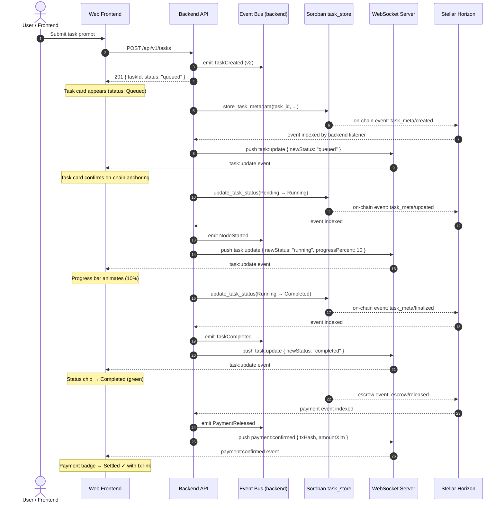
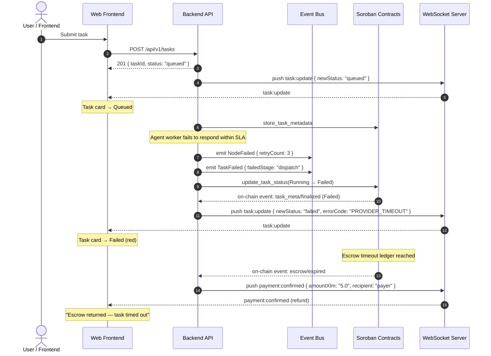
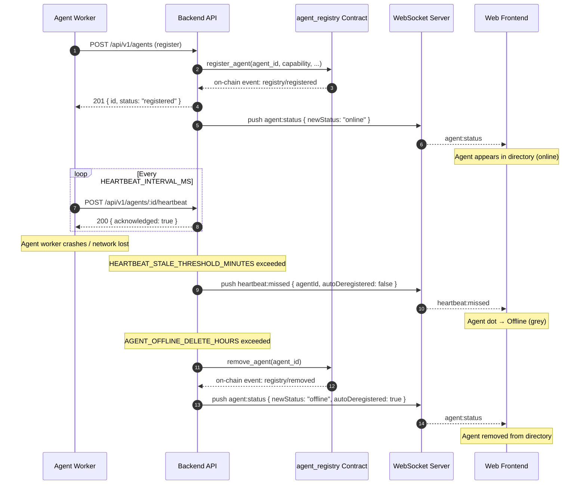

# 📡 AI-Net Canonical Event Schema

This document is the authoritative reference for every event emitted by the
ai-net system. It covers:

1. The backend event-sourcing schema (versioned payloads, migration rules)
2. **All on-chain Soroban contract events** emitted by `agent_registry` and `task_store`
3. **Backend WebSocket / SSE push events** consumed by the frontend
4. **Frontend UI state changes** triggered by each event
5. A full **Event Flow** section with Mermaid sequence diagrams tracing events cross-stack

Cross-links:
- On-chain `task_store` events: [smart-contracts/docs/TASK_STORE_EVENTS.md](../smart-contracts/docs/TASK_STORE_EVENTS.md)
- On-chain `agent_registry` events: [smart-contracts/docs/events.md](../smart-contracts/docs/events.md)
- REST API event replay endpoint: [API_REFERENCE.md — POST /api/v1/events/replay](API_REFERENCE.md#post-apiv1eventsreplay)

---

## Table of Contents

1. [Design Principles](#1-design-principles)
2. [Base Event Envelope](#2-base-event-envelope)
3. [On-Chain Contract Events](#3-on-chain-contract-events)
   - [3.1 agent_registered](#31-agent_registered)
   - [3.2 agent_deregistered](#32-agent_deregistered)
   - [3.3 task_created (on-chain)](#33-task_created-on-chain)
   - [3.4 task_completed (on-chain)](#34-task_completed-on-chain)
   - [3.5 task_disputed](#35-task_disputed)
   - [3.6 escrow_created](#36-escrow_created)
   - [3.7 escrow_released](#37-escrow_released)
   - [3.8 escrow_expired](#38-escrow_expired)
   - [3.9 reputation_updated](#39-reputation_updated)
   - [3.10 change_proposed](#310-change_proposed)
   - [3.11 change_executed](#311-change_executed)
4. [Backend WebSocket Events](#4-backend-websocket-events)
   - [4.1 agent:status](#41-agentstatus)
   - [4.2 task:update](#42-taskupdate)
   - [4.3 payment:confirmed](#43-paymentconfirmed)
   - [4.4 heartbeat:missed](#44-heartbeatmissed)
5. [Backend Event-Sourcing Types](#5-backend-event-sourcing-types)
   - [5.1 TaskCreated](#51-taskcreated)
   - [5.2 NodeStarted](#52-nodestarted)
   - [5.3 NodeCompleted](#53-nodecompleted)
   - [5.4 NodeFailed](#54-nodefailed)
   - [5.5 PaymentLocked](#55-paymentlocked)
   - [5.6 PaymentReleased](#56-paymentreleased)
   - [5.7 TaskCompleted](#57-taskcompleted)
   - [5.8 TaskFailed](#58-taskfailed)
6. [Event Flow: task_created → Frontend Update](#6-event-flow-task_created--frontend-update)
7. [Version Migration Guide for Consumers](#7-version-migration-guide-for-consumers)
8. [On-Chain Event Versioning (Soroban)](#8-on-chain-event-versioning-soroban)
9. [Adding a New Version](#9-adding-a-new-version)

---

## 1. Design Principles

| Principle | Description |
|-----------|-------------|
| **Discriminated union** | Every event carries a `type` field that identifies the concrete shape. |
| **Versioned payloads** | Every event record carries a `version` integer. Consumers branch on this value. |
| **Append-only within a version** | Adding new optional fields does NOT require a version bump — consumers tolerate unknown fields. |
| **Breaking changes bump version** | Removing, renaming, or changing the type of an existing field requires a version bump. |
| **Stable topic pairs** | The `(type)` discriminator is stable across versions; a schema change bumps `version`, not `type`. |
| **Single source of truth** | This document maps events from on-chain → backend → WebSocket → frontend in one place. |

---

## 2. Base Event Envelope

Every backend event-sourcing event shares these base fields:

```typescript
interface BaseEvent {
  type: string;           // Discriminator — identifies the concrete shape
  taskId: string;         // The task this event belongs to
  occurredAt: string;     // ISO-8601 wall-clock time
  version: number;        // Schema version (integer, >= 1)
  globalSeq: number;      // Globally-ordered sequence (assigned on persist)
  taskSeq: number;        // Per-task monotonic cursor (assigned by EventBus)
}
```

---

## 3. On-Chain Contract Events

These events are emitted by Soroban smart contracts and indexed by the backend event listener. The backend translates them into WebSocket pushes (see [Section 4](#4-backend-websocket-events)).

### 3.1 agent_registered

**Source:** `agent_registry` contract  
**Soroban topics:** `["registry", "registered"]`  
**When it fires:** When a new agent successfully calls `register_agent` on the registry contract.

**Payload schema:**
```typescript
interface AgentRegisteredEvent {
  agent_id: string;        // Unique agent ID (Soroban Symbol)
  agent_type: string;      // Capability (e.g. "research", "risk", "coding")
  owner: string;           // Stellar account address of the agent owner
  timestamp: bigint;       // Unix timestamp (u64) of the registration ledger
}
```

**Frontend state change:** Agent appears in the agent directory with status `online`. Reputation badge shows initial score.

---

### 3.2 agent_deregistered

**Source:** `agent_registry` contract  
**Soroban topics:** `["registry", "removed"]`  
**When it fires:** When an agent owner calls `remove_agent` on the registry contract.

**Payload schema:**
```typescript
interface AgentDeregisteredEvent {
  agent_id: string;        // Unique ID of the removed agent
}
```

**Frontend state change:** Agent is removed from the agent directory. Any open task assignments to this agent show a warning banner.

---

### 3.3 task_created (on-chain)

**Source:** `task_store` contract  
**Soroban topics:** `["task_meta", "created"]`  
**When it fires:** When `store_task_metadata` succeeds — exactly once per task.

**Payload schema:**
```typescript
interface TaskCreatedOnChainEvent {
  version: number;                 // u32, currently 1
  task_id: Uint8Array;             // BytesN<32>
  prompt_hash: Uint8Array;         // SHA-256 of the task prompt, BytesN<32>
  assigned_agents: string[];       // Array of Stellar Address strings
  created_at: bigint;              // Unix timestamp u64
  expires_at: bigint;              // Expiry Unix timestamp u64
}
```

**Frontend state change:** New task card appears in the task feed with status chip `Queued`. Escrow lock indicator becomes active.

---

### 3.4 task_completed (on-chain)

**Source:** `task_store` contract  
**Soroban topics:** `["task_meta", "finalized"]` with `final_status = Completed`  
**When it fires:** When `update_task_status` transitions a task to `Completed`.

**Payload schema:**
```typescript
interface TaskFinalizedOnChainEvent {
  version: number;
  task_id: Uint8Array;
  agent: string;           // Address of the agent that finalized the task
  old_status: TaskStatus;
  final_status: "Completed" | "Failed";
  finalized_at: bigint;
}
```

**Frontend state change:** Task card status chip changes to `Completed` (green). Payment confirmation badge shows `Settled` with the transaction hash.

---

### 3.5 task_disputed

**Source:** `dispute_resolution` contract  
**Soroban topics:** `["dispute", "raised"]`  
**When it fires:** When a payer or agent calls `raise_dispute` within the dispute window.

**Payload schema:**
```typescript
interface TaskDisputedEvent {
  task_id: Uint8Array;     // BytesN<32>
  raised_by: string;       // Stellar address of the dispute initiator
  evidence_hash: string;   // IPFS CID of attached evidence
  raised_at: bigint;
}
```

**Frontend state change:** Task card shows `Disputed` status chip (yellow). A dispute tracker widget appears with the evidence hash and voting deadline.

---

### 3.6 escrow_created

**Source:** `payment_escrow` contract  
**Soroban topics:** `["escrow", "locked"]`  
**When it fires:** When funds are successfully locked in escrow for a task bid.

**Payload schema:**
```typescript
interface EscrowCreatedEvent {
  balance_id: string;       // Claimable balance ID (hex-encoded)
  task_id: string;          // Associated task ID
  payer: string;            // Stellar address of the payer
  amount_stroops: bigint;   // Locked amount in stroops (1 XLM = 10_000_000 stroops)
  expires_at: bigint;       // Ledger sequence number when escrow expires
}
```

**Frontend state change:** Escrow lock indicator activates on the task card. Budget bar shows locked amount in XLM.

---

### 3.7 escrow_released

**Source:** `payment_escrow` contract  
**Soroban topics:** `["escrow", "released"]`  
**When it fires:** When the payer or coordinator calls `release_escrow` after task completion.

**Payload schema:**
```typescript
interface EscrowReleasedEvent {
  balance_id: string;
  task_id: string;
  recipient: string;        // Stellar address of the agent receiving payment
  amount_stroops: bigint;
  tx_hash: string;          // Stellar transaction hash of the release operation
  ledger_sequence: number;
}
```

**Frontend state change:** Payment status badge changes to `Settled`. Transaction hash becomes a clickable link to Stellar Explorer. Agent reputation score updates.

---

### 3.8 escrow_expired

**Source:** `payment_escrow` contract  
**Soroban topics:** `["escrow", "expired"]`  
**When it fires:** When the escrow timeout passes without task completion and `expire_and_return` is called.

**Payload schema:**
```typescript
interface EscrowExpiredEvent {
  balance_id: string;
  task_id: string;
  payer: string;             // Funds returned to payer
  amount_stroops: bigint;
  expired_at: bigint;        // Ledger sequence at expiry
}
```

**Frontend state change:** Task card shows `Expired` status. Refund badge shows returned XLM amount. User receives a notification: "Escrow returned — task timed out."

---

### 3.9 reputation_updated

**Source:** `agent_registry` contract  
**Soroban topics:** `["registry", "reputation_upd"]`  
**When it fires:** When the coordinator calls `update_reputation` after a task is completed or disputed.

**Payload schema:**
```typescript
interface ReputationUpdatedEvent {
  agent_id: string;
  old_score: number;     // i128 on-chain, normalised to float [0, 1] for display
  new_score: number;
  reason: "task_completed" | "task_disputed" | "bond_slashed";
  updated_at: bigint;
}
```

**Frontend state change:** Agent detail page reputation chart updates with a new data point. Agent card in directory re-sorts if `minReputation` filter is active.

---

### 3.10 change_proposed

**Source:** `agent_governance` contract  
**Soroban topics:** `["governance", "proposed"]`  
**When it fires:** When an admin calls `propose_change` to initiate a governance parameter update.

**Payload schema:**
```typescript
interface ChangeProposedEvent {
  proposal_id: string;    // Unique proposal identifier
  proposer: string;       // Stellar address of the proposer
  parameter: string;      // Name of the parameter being changed
  current_value: string;  // Current value (serialized as string)
  proposed_value: string; // Proposed new value
  timelock_expires: bigint; // Ledger sequence when timelock expires
}
```

**Frontend state change:** Governance panel shows a new pending proposal with a timelock countdown timer.

---

### 3.11 change_executed

**Source:** `agent_governance` contract  
**Soroban topics:** `["governance", "executed"]`  
**When it fires:** When the timelock expires and an admin calls `execute_change` to apply the proposal.

**Payload schema:**
```typescript
interface ChangeExecutedEvent {
  proposal_id: string;
  executor: string;       // Stellar address of the executor
  parameter: string;
  new_value: string;      // Value now active on-chain
  executed_at: bigint;
}
```

**Frontend state change:** Governance proposal moves from `Pending` to `Executed`. System parameter display updates to reflect the new value.

---

## 4. Backend WebSocket Events

The backend translates on-chain events and internal state changes into WebSocket messages pushed to connected frontend clients. The WebSocket endpoint is `ws://localhost:3001/ws` (or `wss://api.testnet.ai-net.epta-node.io/ws`).

All WebSocket messages share this envelope:
```typescript
interface WebSocketMessage {
  event: string;          // Event name (e.g. "task:update")
  payload: unknown;       // Event-specific payload (see below)
  timestamp: string;      // ISO-8601
  correlationId?: string; // Matches the originating REST request if applicable
}
```

### 4.1 agent:status

**When it fires:** When an agent's status changes (online → offline, offline → online) due to a heartbeat or deregistration.

**Payload schema:**
```typescript
interface AgentStatusPayload {
  agentId: string;
  name: string;
  capability: string;
  oldStatus: "online" | "offline";
  newStatus: "online" | "offline";
  lastHeartbeat: string;  // ISO-8601
}
```

**Triggered by on-chain event:** `agent_registered` → `newStatus: "online"`. Also triggered by heartbeat timeout (backend-internal).

**Frontend state change:** Agent card status dot changes colour (green = online, grey = offline). Agent count badge in nav updates.

---

### 4.2 task:update

**When it fires:** On every task status transition: `queued → running → completed / failed / cancelled`.

**Payload schema:**
```typescript
interface TaskUpdatePayload {
  taskId: string;
  oldStatus: "queued" | "running" | "completed" | "failed" | "cancelled";
  newStatus: "queued" | "running" | "completed" | "failed" | "cancelled";
  agentId?: string;           // Set when agent is assigned
  dagNodeId?: string;         // Set when a specific DAG node changes
  progressPercent?: number;   // 0–100, set during running
  errorCode?: string;         // Set on failure
  errorMessage?: string;
  updatedAt: string;          // ISO-8601
}
```

**Triggered by on-chain event:** `task_created` (on-chain) → `newStatus: "queued"`. `task_completed` → `newStatus: "completed"`.

**Frontend state change:** Task card status chip, progress bar, and timeline animate to reflect the new state.

---

### 4.3 payment:confirmed

**When it fires:** After `escrow_released` is indexed and the Stellar transaction is confirmed by Horizon.

**Payload schema:**
```typescript
interface PaymentConfirmedPayload {
  taskId: string;
  agentId: string;
  amountXlm: string;          // Human-readable XLM amount
  amountStroops: string;      // Raw stroop amount
  txHash: string;             // Stellar transaction hash
  ledgerSequence: number;
  confirmedAt: string;        // ISO-8601
}
```

**Triggered by on-chain event:** `escrow_released`

**Frontend state change:** Payment badge on task card changes to `Settled ✓`. Clicking the badge opens a Stellar Explorer link to the transaction.

---

### 4.4 heartbeat:missed

**When it fires:** When an agent fails to send a heartbeat within `HEARTBEAT_STALE_THRESHOLD_MINUTES` of the last recorded heartbeat.

**Payload schema:**
```typescript
interface HeartbeatMissedPayload {
  agentId: string;
  name: string;
  lastHeartbeat: string;      // ISO-8601 of last received heartbeat
  staleThresholdMinutes: number;
  autoDeregistered: boolean;  // true if AGENT_OFFLINE_DELETE_HOURS elapsed
}
```

**Frontend state change:** Agent card flips to `Offline`. If `autoDeregistered: true`, agent is removed from the directory. Admin notification toast displays.

---

## 5. Backend Event-Sourcing Types

These events are persisted to the `task_events` table in `tasks.db` and are also replayed via `POST /api/v1/events/replay`.

### 5.1 TaskCreated

Emitted when a task is created and enqueued.

#### Version 1

```jsonc
{
  "type": "TaskCreated",
  "taskId": "task_abc123",
  "occurredAt": "2026-08-31T12:00:00.000Z",
  "version": 1,
  "payload": {
    "prompt": "Analyze Stellar DEX liquidity trends",
    "walletPublicKey": "GBZXN7...AAA",
    "dagSize": 3
  }
}
```

#### Version 2 (current)

Adds optional `agentId` and `durationMs` fields.

```jsonc
{
  "type": "TaskCreated",
  "taskId": "task_abc123",
  "occurredAt": "2026-08-31T12:00:00.000Z",
  "version": 2,
  "payload": {
    "prompt": "Analyze Stellar DEX liquidity trends",
    "walletPublicKey": "GBZXN7...AAA",
    "dagSize": 3,
    "agentId": "agent-001",
    "durationMs": 42100
  }
}
```

---

### 5.2 NodeStarted

Emitted when a DAG node begins execution.

#### Version 1

```jsonc
{
  "type": "NodeStarted",
  "taskId": "task_abc123",
  "nodeId": "node_research_1",
  "occurredAt": "2026-08-31T12:00:01.000Z",
  "version": 1,
  "payload": {
    "agentType": "research"
  }
}
```

#### Version 2 (current)

Adds optional `timeoutMs` field.

```jsonc
{
  "type": "NodeStarted",
  "taskId": "task_abc123",
  "nodeId": "node_research_1",
  "occurredAt": "2026-08-31T12:00:01.000Z",
  "version": 2,
  "payload": {
    "agentType": "research",
    "timeoutMs": 30000
  }
}
```

---

### 5.3 NodeCompleted

Emitted when a DAG node completes successfully.

#### Version 1

```jsonc
{
  "type": "NodeCompleted",
  "taskId": "task_abc123",
  "nodeId": "node_research_1",
  "occurredAt": "2026-08-31T12:00:15.000Z",
  "version": 1,
  "payload": {
    "result": { "summary": "Liquidity increased by 14%", "sources": 5 }
  }
}
```

#### Version 2 (current)

Adds optional `durationMs` field.

```jsonc
{
  "type": "NodeCompleted",
  "taskId": "task_abc123",
  "nodeId": "node_research_1",
  "occurredAt": "2026-08-31T12:00:15.000Z",
  "version": 2,
  "payload": {
    "result": { "summary": "Liquidity increased by 14%", "sources": 5 },
    "durationMs": 14000
  }
}
```

---

### 5.4 NodeFailed

Emitted when a DAG node fails after exhausting retries.

#### Version 2 (current)

```jsonc
{
  "type": "NodeFailed",
  "taskId": "task_abc123",
  "nodeId": "node_risk_1",
  "occurredAt": "2026-08-31T12:01:00.000Z",
  "version": 2,
  "payload": {
    "error": "Agent timeout after 30s",
    "retryCount": 3
  }
}
```

---

### 5.5 PaymentLocked

Emitted when XLM is locked in escrow for an agent.

#### Version 2 (current)

```jsonc
{
  "type": "PaymentLocked",
  "taskId": "task_abc123",
  "nodeId": "node_research_1",
  "occurredAt": "2026-08-31T12:00:02.000Z",
  "version": 2,
  "payload": {
    "balanceId": "000000...",
    "amountStroops": 50000000,
    "xlmAmount": 5.0
  }
}
```

---

### 5.6 PaymentReleased

Emitted when escrowed funds are released to the agent.

#### Version 2 (current)

```jsonc
{
  "type": "PaymentReleased",
  "taskId": "task_abc123",
  "nodeId": "node_research_1",
  "occurredAt": "2026-08-31T12:00:16.000Z",
  "version": 2,
  "payload": {
    "txHash": "d8e3b4a2c1f9e8d7...",
    "ledgerSequence": 5241098
  }
}
```

---

### 5.7 TaskCompleted

Emitted when all DAG nodes complete successfully.

#### Version 2 (current)

```jsonc
{
  "type": "TaskCompleted",
  "taskId": "task_abc123",
  "occurredAt": "2026-08-31T12:01:30.000Z",
  "version": 2,
  "payload": {
    "durationMs": 90000
  }
}
```

---

### 5.8 TaskFailed

Emitted when a task fails (all retries exhausted or a non-recoverable error).

#### Version 2 (current)

```jsonc
{
  "type": "TaskFailed",
  "taskId": "task_abc123",
  "occurredAt": "2026-08-31T12:01:30.000Z",
  "version": 2,
  "payload": {
    "error": "All agent dispatches failed",
    "failedStage": "dispatch"
  }
}
```

---

## 6. Event Flow: task_created → Frontend Update

The following diagrams trace a complete event chain from on-chain contract emission through to frontend UI update.

### 6.1 Happy Path: Task Submission to Completion



### 6.2 Failure Path: Agent Timeout → Escrow Expiry



### 6.3 Agent Registration + Heartbeat Lifecycle



---

## 7. Version Migration Guide for Consumers

### 7.1 Reading events

Consumers **must** check the `version` field before accessing version-specific
fields:

```typescript
function handleTaskCreated(event: TaskCreatedEvent): void {
  console.log(event.payload.prompt);

  // v2+ fields are optional — always guard with a version check
  if (event.version >= 2 && event.payload.agentId) {
    console.log(`Dispatched to agent: ${event.payload.agentId}`);
  }
}
```

### 7.2 Unknown fields

The schema is append-only within a major version. New optional fields may
appear without a version bump. Consumers **must tolerate** unknown fields:

```typescript
// ✅ Safe — unknown fields are ignored
const { prompt, walletPublicKey } = event.payload;

// ❌ Unsafe — will break if new fields are added
const payload = event.payload as Exact<TaskCreatedPayload>;
```

### 7.3 Version downgrade

If consumers receive events with a version higher than the current schema
(e.g. during a rolling upgrade):

1. Log a warning.
2. Attempt to process the event using the latest known schema.
3. Skip fields not recognized.

### 7.4 Migration from v1 to v2

Version 2 adds **only optional fields** — no v1 fields are removed, renamed,
or retyped. Therefore:

- V1 events are valid v2 events (v1 fields are a subset of v2 fields).
- No data transformation is needed.
- Consumers can process v1 and v2 events with the same handler.

---

## 8. On-Chain Event Versioning (Soroban)

The Soroban smart contracts (`task_store`, `agent_registry`) maintain their
own event versioning via the `version: u32` field in contract event payloads.
These are separate from the backend event-sourcing versions but follow the
same compatibility rules:

- **Append-only**: Adding new fields does not require a version bump.
- **Breaking changes bump version**: Consumers branch on `version`.
- **Topic pairs are stable**: A breaking change bumps `version` in the payload, not the topic.

See [TASK_STORE_EVENTS.md](../smart-contracts/docs/TASK_STORE_EVENTS.md) and
[events.md](../smart-contracts/docs/events.md) for contract-specific details.

---

## 9. Adding a New Version

When a breaking change is required:

1. **Bump `CURRENT_EVENT_VERSION`** in `backend/src/events/eventTypes.ts`.
2. **Add Zod schemas** for the new version in `backend/src/events/schemaRegistry.ts`.
3. **Add migration logic** in `migrateEvent()` in the schema registry.
4. **Update payload interfaces** in `eventTypes.ts` with new fields (marked `/** vN: ... */`).
5. **Update this document** (`docs/EVENTS.md`) with examples for the new version.
6. **Run `bun tsc -b --noEmit`** to verify types compile.
7. **Add tests** in `backend/tests/eventSchemaRegistry.test.ts`.
