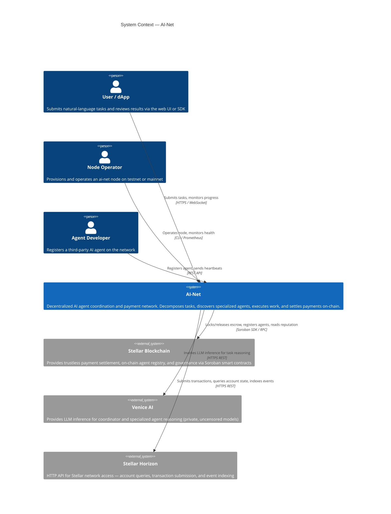
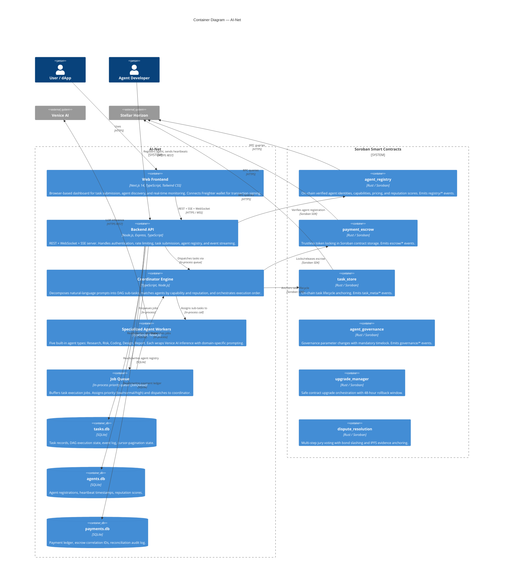
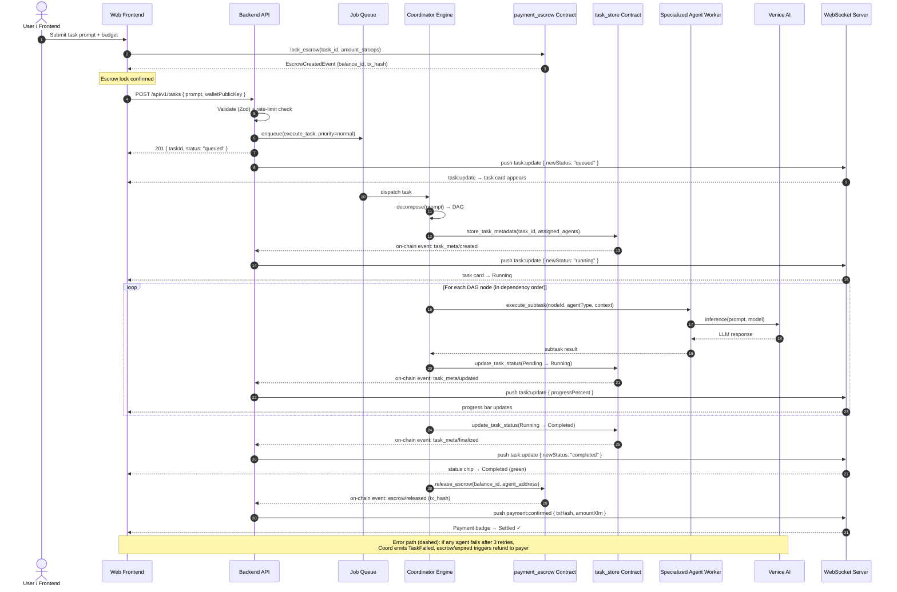
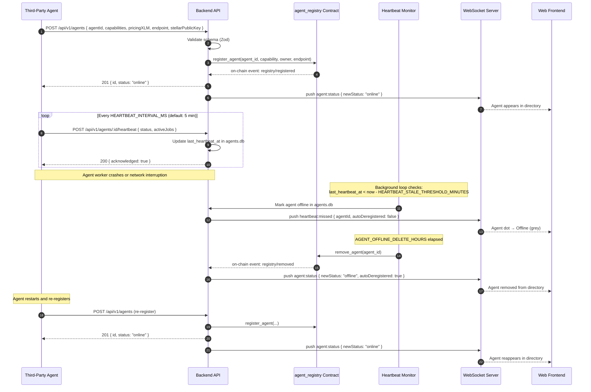
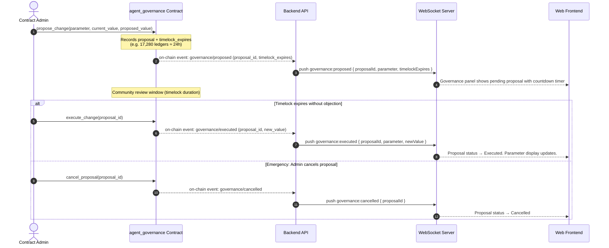
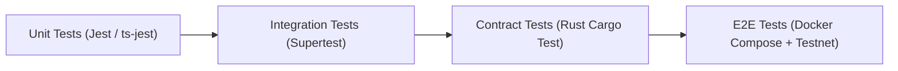

# 🏛️ AI-Net Architecture Specification

This document is the **authoritative technical reference** for the AI-Net platform — a decentralized marketplace and multi-agent coordination protocol built on the **Stellar Network and Soroban Smart Contracts**.

---

## Table of Contents

1. [C4 Level 1 — System Context](#1-c4-level-1--system-context)
2. [C4 Level 2 — Container Diagram](#2-c4-level-2--container-diagram)
3. [C4 Level 3 — Backend Component Diagram](#3-c4-level-3--backend-component-diagram)
4. [Sequence Diagrams](#4-sequence-diagrams)
   - [4.1 Task Submission to Completion (Happy Path with Escrow)](#41-task-submission-to-completion-happy-path-with-escrow)
   - [4.2 Agent Registration + Heartbeat Lifecycle](#42-agent-registration--heartbeat-lifecycle)
   - [4.3 Governance Proposal + Timelock Execution](#43-governance-proposal--timelock-execution)
5. [Layer Responsibilities](#5-layer-responsibilities)
6. [Security Model](#6-security-model)
7. [Related Documents](#7-related-documents)

---

## 1. C4 Level 1 — System Context

The system context diagram shows ai-net as a single system, the external actors that interact with it, and the external systems it depends on.

---

## 2. C4 Level 2 — Container Diagram

The container diagram shows the major deployable units inside AI-Net and their data flows.

---

## 3. C4 Level 3 — Backend Component Diagram

The component diagram shows the major modules inside the Backend API container.

```mermaid
C4Component
    title Component Diagram — Backend API

    Container_Boundary(api, "Backend API") {
        Component(router, "Express Router", "Express.js", "Routes HTTP requests to domain handlers. Mounts v1 and v2 route trees. Applies global middleware (CORS, compression, request ID).")

        Component(auth_mw, "Auth Middleware", "TypeScript", "Validates JWT Bearer tokens and X-API-Key headers. Enforces wallet-based session authentication.")
        Component(rate_limit_mw, "Rate Limit Middleware", "TypeScript", "Enforces per-wallet, per-agent, and per-route request quotas. Returns X-RateLimit-* headers.")
        Component(validate_mw, "Validation Middleware", "Zod", "Validates request bodies and query params against Zod schemas. Returns 400 VALIDATION_ERROR on failure.")

        Component(agents_handler, "Agents Handler", "TypeScript", "Handles agent CRUD, heartbeat, and reputation endpoints. Reads/writes agents.db.")
        Component(tasks_handler, "Tasks Handler", "TypeScript", "Handles task create, list, get, cancel, estimate, and stream endpoints. Reads/writes tasks.db.")
        Component(stats_handler, "Stats Handler", "TypeScript", "Aggregates network metrics from all three SQLite databases. TTL-cached for 60 s.")
        Component(events_handler, "Events Handler", "TypeScript", "Handles event replay requests. Reads task_events table from tasks.db.")
        Component(auth_handler, "Auth Handler", "TypeScript", "Issues, refreshes, and revokes session tokens tied to Stellar wallet public keys.")
        Component(admin_handler, "Admin Handler", "TypeScript", "Protected admin operations: read-only mode, backup, vacuum, circuit breaker reset, audit log.")
        Component(health_handler, "Health Handler", "TypeScript", "Liveness, readiness, and deep dependency probes.")

        Component(coordinator_svc, "Coordinator Service", "TypeScript", "Decomposes prompts into DAG execution plans. Orchestrates agent dispatch and result aggregation.")
        Component(agent_workers, "Agent Workers", "TypeScript", "Research, Risk, Coding, Design, Report — each wraps Venice AI inference.")
        Component(payment_svc, "Payment Service", "TypeScript", "Soroban SDK integration for escrow lock/release. Reconciles on-chain vs local payment state.")
        Component(registry_svc, "Registry Service", "TypeScript", "Soroban SDK integration for agent_registry contract read/write operations.")
        Component(event_bus, "Event Bus", "TypeScript", "In-process event sourcing. Persists events to task_events table. Publishes to WebSocket server.")
        Component(ws_server, "WebSocket Server", "ws / TypeScript", "Manages connected clients. Broadcasts agent:status, task:update, payment:confirmed, heartbeat:missed events.")
        Component(heartbeat_monitor, "Heartbeat Monitor", "TypeScript", "Background loop that checks agents.db for stale agents and marks them offline.")
        Component(circuit_breaker, "Circuit Breaker", "TypeScript", "Wraps Venice AI calls. Opens after N consecutive failures; auto-closes after reset timeout.")
        Component(reconciliation_svc, "Reconciliation Service", "TypeScript", "Compares payments.db ledger with on-chain Stellar state. Resolves discrepancies.")

        ContainerDb(tasks_db, "tasks.db", "SQLite")
        ContainerDb(agents_db, "agents.db", "SQLite")
        ContainerDb(payments_db, "payments.db", "SQLite")
    }

    Container_Ext(venice, "Venice AI")
    Container_Ext(soroban, "Soroban Contracts")

    Rel(router, auth_mw, "Applied to protected routes")
    Rel(router, rate_limit_mw, "Applied to all routes")
    Rel(router, validate_mw, "Applied to mutation routes")
    Rel(router, agents_handler, "Routes /api/v*/agents")
    Rel(router, tasks_handler, "Routes /api/v*/tasks")
    Rel(router, stats_handler, "Routes /api/v1/stats")
    Rel(router, events_handler, "Routes /api/v1/events")
    Rel(router, auth_handler, "Routes /api/v1/auth")
    Rel(router, admin_handler, "Routes /api/v1/admin")
    Rel(router, health_handler, "Routes /health")
    Rel(tasks_handler, coordinator_svc, "Dispatches via job queue")
    Rel(coordinator_svc, agent_workers, "Assigns sub-tasks")
    Rel(agent_workers, circuit_breaker, "All Venice AI calls")
    Rel(circuit_breaker, venice, "HTTPS inference requests")
    Rel(coordinator_svc, payment_svc, "Lock/release escrow")
    Rel(payment_svc, soroban, "Soroban SDK")
    Rel(agents_handler, registry_svc, "On-chain registration")
    Rel(registry_svc, soroban, "Soroban SDK")
    Rel(coordinator_svc, event_bus, "Emits events")
    Rel(event_bus, tasks_db, "Persists events")
    Rel(event_bus, ws_server, "Broadcasts updates")
    Rel(agents_handler, agents_db, "CRUD")
    Rel(tasks_handler, tasks_db, "CRUD")
    Rel(payment_svc, payments_db, "Ledger writes")
    Rel(reconciliation_svc, payments_db, "Reads payment state")
    Rel(reconciliation_svc, soroban, "Queries on-chain state")
    Rel(heartbeat_monitor, agents_db, "Reads heartbeat timestamps")
    Rel(heartbeat_monitor, ws_server, "Pushes heartbeat:missed")
    Rel(stats_handler, tasks_db, "Aggregates metrics")
    Rel(stats_handler, agents_db, "Aggregates metrics")
    Rel(stats_handler, payments_db, "Aggregates metrics")
```

---

## 4. Sequence Diagrams

### 4.1 Task Submission to Completion (Happy Path with Escrow)

The full lifecycle from user submission through coordinator orchestration, multi-agent execution, and on-chain escrow settlement.

### 4.2 Agent Registration + Heartbeat Lifecycle

### 4.3 Governance Proposal + Timelock Execution

---

## 5. Layer Responsibilities

AI-Net is partitioned into three decoupled layers:

### Presentation Layer (`frontend/`)

- Next.js 14 App Router, TypeScript, Tailwind CSS, Lucide icons.
- Stellar wallet integration (Freighter) for transaction signing and identity.
- Real-time task execution telemetry via Server-Sent Events (SSE) and WebSocket.
- Skeleton loading states and error boundaries for all async operations.

### Orchestration & Coordination Layer (`backend/`)

- Node.js 20, Express, TypeScript — REST API, WebSocket server, SSE streaming.
- **Coordinator Engine**: Decomposes natural-language prompts into DAGs of sub-tasks using Venice AI.
- **Specialized Workers**: Research, Risk, Coding, Design, Report — each wraps Venice AI with domain prompting.
- **Event Sourcing**: All task state changes are persisted as append-only events in `tasks.db`.
- **Persistence**: Three SQLite databases (`tasks.db`, `agents.db`, `payments.db`) with schema-versioned migrations.
- **Circuit Breakers**: Wrap Venice AI and Horizon calls with fail-fast protection and exponential backoff.

### Decentralized Settlement Layer (`smart-contracts/`)

Written in Rust for the Soroban Smart Contract platform on Stellar.

| Contract | Responsibility |
|---|---|
| `agent_registry` | On-chain agent identities, capabilities, pricing, and reputation scores |
| `payment_escrow` | Trustless XLM locking with time-locked refund safety nets |
| `task_store` | On-chain task lifecycle anchoring (created / updated / finalized) |
| `agent_governance` | Governance parameter changes with mandatory timelock |
| `agent_bidding` | Sealed-bid auction (`0.60 × Price + 0.40 × Reputation` composite score) |
| `dispute_resolution` | Multi-step jury voting with bond slashing and IPFS evidence |
| `upgrade_manager` | Safe contract upgrades with 48-hour rollback window |
| `error_registry` | On-chain error code registry for consistent error reporting |

---

## 6. Security Model

### Contract Invariants

- Every on-chain mutation performs strict authorization (`require_auth()`).
- State is stored in `Instance` storage for singletons; `Persistent`/`Temporary` for TTL-managed entities.
- No unbounded vectors in contract storage — collections enforce pagination cursors.

### Backend Security

- Wallet-based authentication: challenge → Freighter sign → JWT session.
- All mutations enforce idempotency keys to prevent double-submission.
- Rate limiting applied per wallet, per agent, and per route tier.
- Input validation via Zod on every request — max prompt length enforced to prevent token-cost abuse.
- Circuit breakers prevent Venice AI timeout storms from cascading into task failures.

### Testing Architecture

---

## 7. Related Documents

- [Payment Flows & Escrow Lifecycle](payment-escrow-lifecycle.md) — Detailed escrow state machine, dispute flows, and reconciliation
- [Governance Timelock](governance-timelock.md) — Governance proposal and execution flow
- [REST API Reference](../API_REFERENCE.md) — All endpoint documentation with curl examples
- [Events Reference](../EVENTS.md) — On-chain and WebSocket event schemas with full cross-stack flow diagrams
- [Node Operators Guide](../NODE_OPERATORS_GUIDE.md) — Node provisioning, configuration, and monitoring
- [Operational Runbooks](../operations/RUNBOOKS.md) — Incident response procedures
- [Testnet Upgrade Runbook](../../smart-contracts/docs/TESTNET_UPGRADE_RUNBOOK.md) — Contract upgrade and rollback procedures
