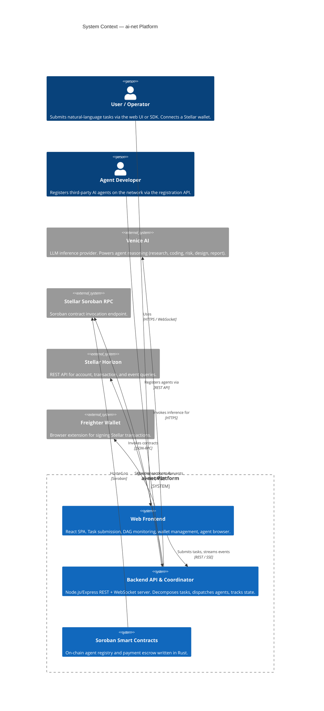
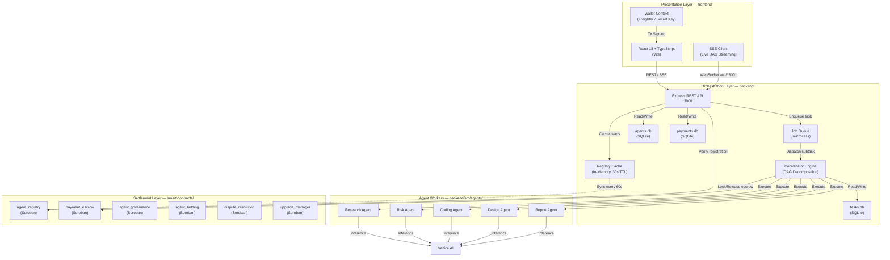
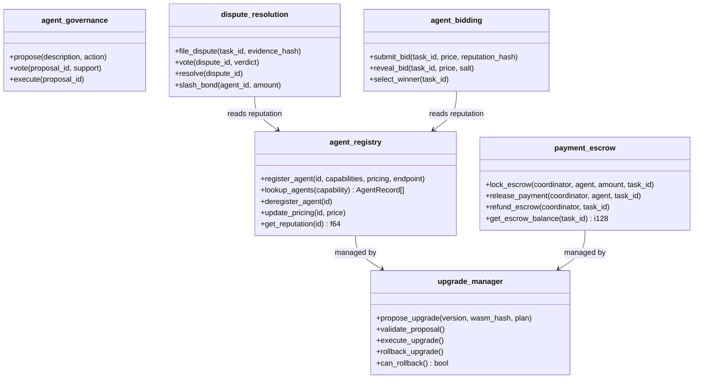
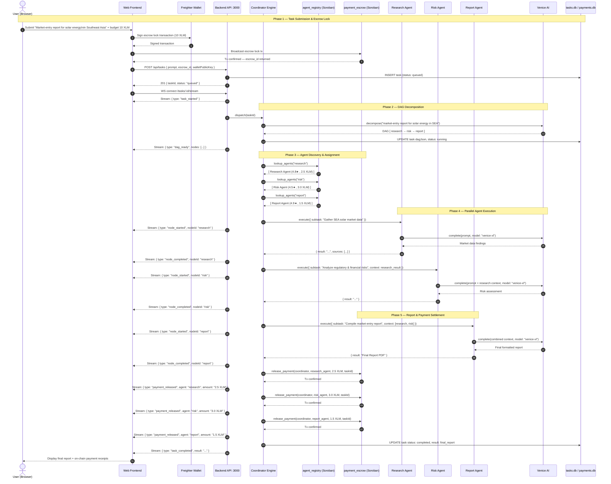
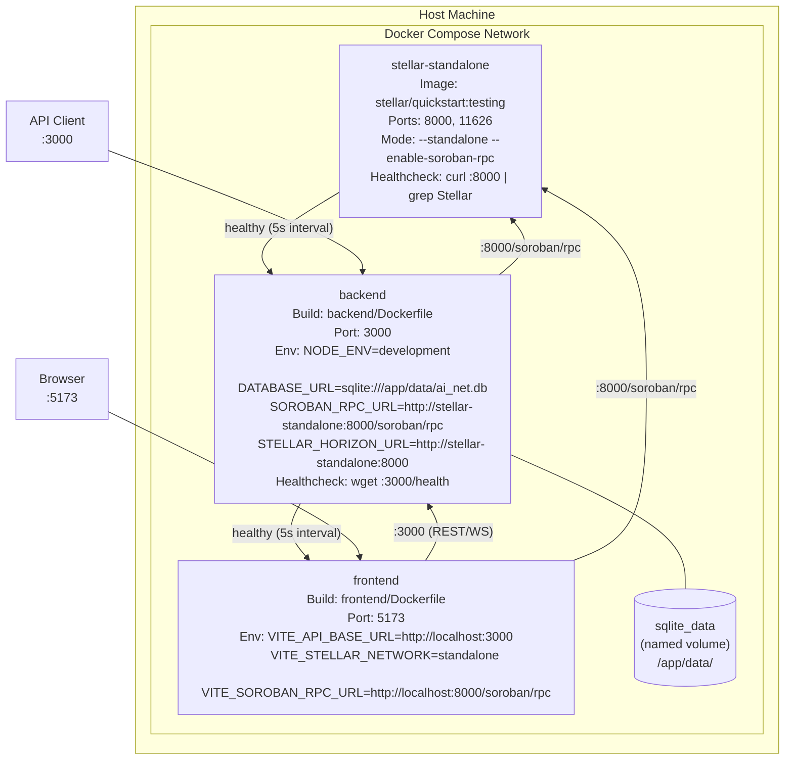
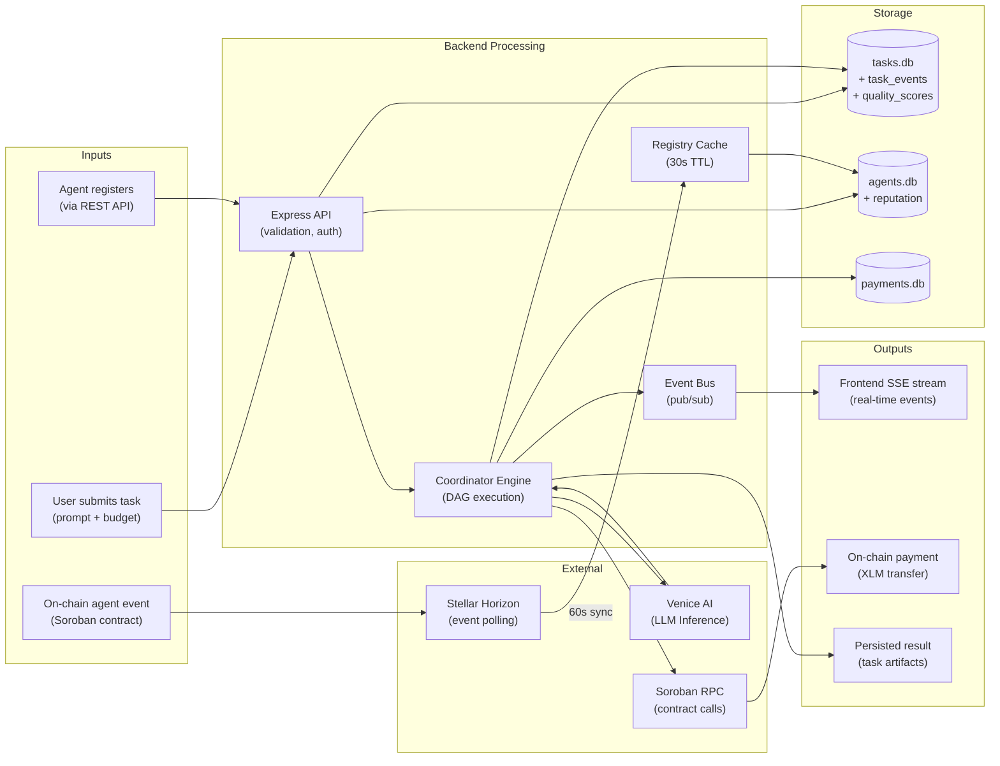

# AI-Net Architecture Specification

Top-level technical reference for the ai-net platform — a decentralized agent coordination network built on the Stellar blockchain and Soroban smart contracts.

---

## Table of Contents

1. [System Context Diagram (C4 Level 1)](#1-system-context-diagram-c4-level-1)
2. [Component Architecture](#2-component-architecture)
3. [Sequence Diagram: Full Task Execution Flow](#3-sequence-diagram-full-task-execution-flow)
4. [Deployment Diagram (Docker Compose)](#4-deployment-diagram-docker-compose)
5. [Data Flow Diagram](#5-data-flow-diagram)
6. [Security Model](#6-security-model)
7. [Technology Decisions Rationale](#7-technology-decisions-rationale)

---

## 1. System Context Diagram (C4 Level 1)

The following C4 context diagram shows all external actors and systems that interact with the ai-net platform boundary.



---

## 2. Component Architecture

### 2.1 Layer Overview



### 2.2 Soroban Contract Map



---

## 3. Sequence Diagram: Full Task Execution Flow

The following sequence diagram covers the complete market-entry report demo: from user submission through DAG execution, agent coordination, Venice AI inference, and final on-chain payment settlement.



---

## 4. Deployment Diagram (Docker Compose)

The following diagram reflects the exact services and their relationships in `docker-compose.yml`.



**Service startup order:** `stellar-standalone` → `backend` (waits for stellar healthy) → `frontend` (waits for backend healthy)

**Quick start:**

```bash
docker compose up -d
# Frontend:  http://localhost:5173
# Backend:   http://localhost:3000
# Stellar:   http://localhost:8000/soroban/rpc
```

---

## 5. Data Flow Diagram

### 5.1 Where Data Lives

| Data Store | File | Owner | Contents |
|---|---|---|---|
| `agents.db` | `<cwd>/agents.db` | backend | Agent registrations, capabilities, reputation |
| `tasks.db` | `<cwd>/tasks.db` | backend | Tasks, DAG state, quality scores, task events |
| `payments.db` | `<cwd>/payments.db` | backend | Payment records and escrow status |
| Docker volume | `sqlite_data:/app/data` | compose | Persistent storage across container restarts |
| On-chain storage | Stellar ledger | Soroban | Agent registry entries, escrow balances |
| Registry cache | In-process memory | backend | 30-second TTL cache of on-chain agent data |

### 5.2 Data Flow



---

## 6. Security Model

### 6.1 Authentication

| Layer | Mechanism |
|---|---|
| Frontend → Backend API | `X-Wallet-Public-Key` header (Stellar public key). Verified against task ownership before streaming. |
| Agent → Backend API | `Authorization: Bearer <secret>` per agent registration. Secrets are stored as bcrypt hashes. |
| WebSocket connection | First message must contain `{ walletPublicKey }` matching the task owner. Rejected with close frame `4403` otherwise. |
| Soroban contracts | `require_auth()` on every mutating invocation. Only the deployer or upgrade manager can upgrade. |

### 6.2 Authorization

- **Task access:** Each task is associated with a `walletPublicKey`. The API rejects read/stream requests where the `X-Wallet-Public-Key` header does not match the task's recorded public key.
- **Agent registration:** Agents must provide a signed Stellar challenge to deregister or update pricing. The backend verifies the signature against the registered `stellarPublicKey`.
- **Contract admin operations:** All admin-level contract calls (upgrade, governance, slashing) require the deployer's Stellar keypair to sign the transaction. Multi-signature is recommended for mainnet.
- **Rate limiting:** 100 requests/min per IP via `express-rate-limit`. LLM calls are additionally capped by per-wallet daily quotas enforced before forwarding to Venice AI.

### 6.3 Key Management

| Key Type | Storage Recommendation |
|---|---|
| `STELLAR_SECRET_KEY` (deployer) | GitHub Actions secrets for CI/CD. Hardware wallet (Ledger) for mainnet. |
| `VENICE_API_KEY` | Environment variable. Never logged or returned in API responses. |
| Agent `stellarPublicKey` | Public — stored in `agents.db` and on-chain registry. |
| Agent secret | Stored as bcrypt hash in `agents.db`. Never stored in plaintext. |
| Testnet keys | `.env` file (gitignored). Separate from mainnet keys. |

**Key rotation:** Rotate `STELLAR_SECRET_KEY` after each mainnet deployment. Rotating the Venice API key requires redeploying the backend with the new value.

### 6.4 On-Chain Security Invariants

All Soroban contracts enforce:

1. **`require_auth()`** on every state-mutating function — no anonymous writes.
2. **Bounded storage** — agent capability arrays are capped at 10 entries to prevent unbounded storage growth.
3. **Pagination cursors** on collections — avoids returning unbounded result sets.
4. **Escrow immutability** — locked escrow can only be released by the locking coordinator key, preventing unauthorized withdrawals.
5. **Dispute evidence hashing** — evidence submitted to `dispute_resolution` is stored as SHA-256 hashes; raw content stays off-chain.

### 6.5 Circuit Breakers and Resilience

- Venice AI calls are wrapped in a circuit breaker: opens after 3 consecutive failures, stays open for 60 seconds before attempting recovery.
- Stellar Horizon calls use exponential backoff (up to 5 retries) for `TIMEOUT` and `TOO_MANY_REQUESTS` errors.
- Database connections use a connection pool with a 5-second acquire timeout and automatic reconnection on failure.

### 6.6 Input Validation

- All REST request bodies are validated with **Zod** schemas at the API boundary before reaching business logic.
- Task prompts are capped at 1,000 characters before being forwarded to Venice AI.
- SQL queries use **parameterized statements** exclusively — no string interpolation anywhere in the database layer.

---

## 7. Technology Decisions Rationale

### Stellar / Soroban for Payments and Registry

Stellar is purpose-built for fast, low-cost asset transfers. XLM transaction fees are fractions of a cent, settlement is final in 3–5 seconds, and the Soroban smart contract platform provides an auditable, sandboxed execution environment for the agent registry and escrow logic. Alternative EVM chains were evaluated but rejected due to higher fees and longer finality times that would make micro-payment flows per-agent-subtask economically impractical.

### SQLite over PostgreSQL

The backend uses three SQLite databases (`agents.db`, `tasks.db`, `payments.db`) rather than a single PostgreSQL instance. This simplifies local development (no separate database service required), eliminates a network hop on every query, and aligns with the single-node deployment model of the initial release. Each database file is versioned by its own schema migration table and managed by the shared `migrator.ts` module. When horizontal scaling is needed, the SQLite files can be replaced with a PostgreSQL-backed implementation behind the same interface.

### Venice AI for LLM Inference

Venice AI offers privacy-preserving, uncensored model inference with an OpenAI-compatible API. Agent prompts never leave the Venice infrastructure to train third-party models. The model routing map (`research/risk/design/report → venice-xl`, `coding → venice-code`) was chosen to match capability requirements while minimizing token costs.

### Playwright (Chromium-only) for Visual Regression

Visual screenshots are pixel-tied to a single browser rendering engine and OS font stack. Running the visual suite on Chromium only (via a pinned `mcr.microsoft.com/playwright` Docker image) means baselines need to be maintained only once, and rendering drift from OS differences is eliminated. Firefox and WebKit functional tests still run in the separate e2e suite.

### Node.js + Express for the Backend

The coordinator's primary work is I/O-bound (Stellar RPC calls, Venice AI calls, SQLite reads). Node.js's event loop model handles high concurrency for these workloads without thread management overhead. The Express framework was chosen for its minimal surface area and compatibility with the existing team's TypeScript conventions.

### Vite + React 18 for the Frontend

Vite provides sub-second HMR and optimized production builds with ES module chunking. React 18's concurrent features (Suspense, transitions) support the skeleton loading states and real-time streaming UI required by the task monitoring dashboard. Server-Sent Events (SSE) were chosen over WebSockets for the task event stream because they are unidirectional, automatically reconnecting, and compatible with HTTP/2 multiplexing.

---

## Related Documents

- [Payment Flows & Escrow Lifecycle](payment-escrow-lifecycle.md) — detailed payment state machine and reconciliation design
- [Governance Timelock](governance-timelock.md) — on-chain governance proposal and voting flow
- [Smart Contract Deployment Guide](../../smart-contracts/docs/DEPLOYMENT_GUIDE.md)
- [Database Schema](../DATABASE_SCHEMA.md)
- [Frontend Architecture](../FRONTEND_ARCHITECTURE.md)
- [API Reference](../API_REFERENCE.md)
