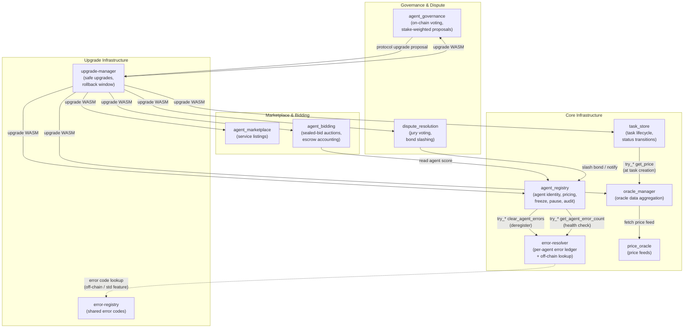
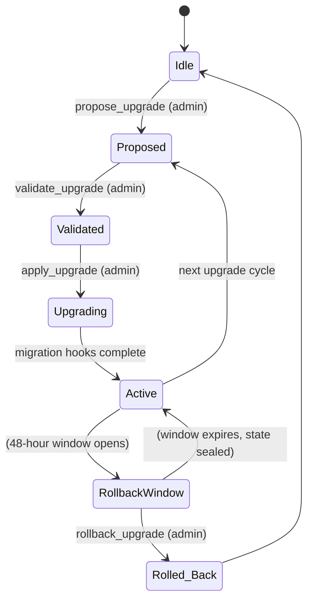

# Smart Contract Architecture & Security Model

This document is the authoritative reference for all Soroban smart contracts in
the AI-Net platform. It covers contract dependencies, authorization rules,
storage layouts, event schemas, known attack vectors and mitigations, upgrade
safety, and economic-security guarantees.

> **Related documents**
> - [Architecture Index](index.md) — system-level overview and component map
> - [Security Audit Trail](../../smart-contracts/docs/security.md) — audit log and anomaly detection details for `agent_registry`
> - [Agent Bidding Security](../../smart-contracts/docs/agent-bidding-security.md) — full threat model for sealed-bid auctions
> - [Task Store Events](../../smart-contracts/docs/TASK_STORE_EVENTS.md) — versioned event schema for task lifecycle
> - [Deployment Guide](../../smart-contracts/docs/DEPLOYMENT_GUIDE.md) — deployment and upgrade workflows
> - [Upgrade Guide](../../smart-contracts/docs/UPGRADE_GUIDE.md) — upgrade procedures and rollback instructions
> - [Storage Migration Guide](../../smart-contracts/docs/STORAGE_MIGRATION.md) — storage migration guidelines

---

## 1. Contract Dependency Diagram

The diagram below shows every contract and the runtime cross-contract calls
between them. Arrows indicate call direction (caller → callee).



**Cross-contract call policy**: every cross-contract call from `agent_registry`
uses the Soroban SDK `try_*` (non-panicking) variants. A failure of the
callee — whether `error-resolver` is unconfigured, unreachable, or rejects the
call — never blocks the caller's own operation. See §5 (Attack Vectors) for why
this matters.

---

## 2. Authorization Model

Every on-chain state mutation in every contract calls `require_auth()` on the
appropriate address before touching storage. The table below documents which
role is required for each entry point, organized by contract.

### 2.1 `agent_registry`

| Function | Required Role | Notes |
|---|---|---|
| `initialize` | — | One-shot; `AlreadyInitialized` on repeat calls |
| `register_agent` | Agent (self) | Agent signs their own registration; bond ≥ `min_bond` |
| `deregister_agent` | Agent (self) or Admin | Admin can forcibly remove; triggers cross-contract `clear_agent_errors` |
| `update_agent` | Agent (self) | Update pricing, endpoint, capabilities |
| `set_sla_terms` | Agent (self) | Set SLA metrics on own record |
| `record_sla_check` | Admin | SLA violation tracking |
| `get_agent` / `get_agents` | — (read-only) | No auth required |
| `get_agent_health` | — (read-only) | Calls `error-resolver` via `try_get_agent_error_count` |
| `discover_agents` | — (read-only) | Discovery oracle; reads cache |
| `freeze_agent` | Admin | Suspends agent; audit-logged |
| `unfreeze_agent` | Admin | Restores agent; audit-logged |
| `pause` | Admin (or multisig proposal) | Pauses all mutations; audit-logged |
| `unpause` | Admin (or multisig proposal) | Restores mutations; audit-logged |
| `slash_bond` | Admin (or multisig proposal) | Deducts bond; audit-logged with `amount_stroops` |
| `set_admin` | Current Admin | Logged against the outgoing admin's address |
| `set_min_bond` | Admin | Audit-logged with new minimum |
| `set_error_resolver` | Admin | Configures cross-contract `error-resolver` address |
| `set_error_ttl` | Admin | Audit-logged |
| `set_gas_config` | Admin | Audit-logged |
| `set_storage_config` | Admin | Audit-logged |
| `set_audit_config` | Admin | Audit-logged |
| `set_multisig_config` | Admin | Configures M-of-N multi-sig signers and timelock delay |
| `propose_action` | Multisig Admin Signer | Submits a proposal for M-of-N approval |
| `approve_proposal` | Multisig Admin Signer | Approves a pending proposal |
| `execute_proposal` | Any (after timelock + approval threshold met) | Executes the action |
| `cancel_proposal` | Proposer | Cancels an unexecuted proposal |
| `upgrade` | Admin | Soroban WASM upgrade; delegates to `upgrade-manager` |
| `bridge_identity` | Agent (self) | Attests cross-chain identity; audit-logged |
| `revoke_bridge_proof` | Agent (self) or Admin | Revokes a bridge attestation; audit-logged |
| `get_audit_log` | — (read-only) | Paginated; max 50 per page |
| `get_audit_total` | — (read-only) | Returns total audit entry count |

### 2.2 `error-resolver`

The contract has a **double-check** model: a caller must (a) be the actual
direct invoker (proven via `caller.require_auth()`) **and** (b) be present on
the admin-managed allowlist.

| Function | Required Role | Notes |
|---|---|---|
| `initialize` | — | One-shot |
| `record_error` | Authorized Caller (allowlist) | Caller must also `require_auth()`; allowlist membership alone is not sufficient |
| `get_agent_error_count` | — (read-only) | |
| `clear_agent_errors` | Authorized Caller (allowlist) | Same double-check as `record_error` |
| `add_authorized_caller` | Admin | Adds address to allowlist |
| `remove_authorized_caller` | Admin | Removes address from allowlist |
| `set_error_ttl` | Admin | Sets per-record TTL |

### 2.3 `task_store`

| Function | Required Role | Notes |
|---|---|---|
| `initialize` | — | One-shot; stores admin and optional `OracleManager` |
| `store_task_metadata` | Any assigned agent (in `assigned_agents`) | Agent must `require_auth()` |
| `update_task_status` | The specific agent whose address matches the updating agent | Non-terminal: `Pending→Running`; terminal: `→Completed` / `→Failed` |
| `get_task_metadata` / `get_task_status` | — (read-only) | |
| `set_oracle_manager` | Admin | Configures optional oracle for quoted prices |
| `upgrade` | Admin | WASM upgrade |

### 2.4 `agent_bidding`

| Function | Required Role | Notes |
|---|---|---|
| `initialize` | — | One-shot |
| `create_auction` | Any (creator) | Creator funds the auction |
| `submit_bid` | Bidder (self) | One bid per `(task_id, bidder)` |
| `reveal_bid` | Bidder (self) | Only during reveal window; verifies SHA-256 commitment |
| `reveal_bids` | Any authenticated caller | Permissionless but attributable; outcome is deterministic |
| `award_contract` | Creator or Winner | Any other caller gets `Unauthorized` |
| `abort_auction` | Any authenticated caller | Only after `reveal_deadline` with zero reveals |
| `claim_refund` | Bidder (self) | Within `CLAIM_WINDOW_SECS` of deadline on unresolved auction |
| `get_auction` / `get_bid` / `get_bidders` | — (read-only) | `get_bidders` is paginated |
| `upgrade` | Admin | WASM upgrade |

### 2.5 `agent_marketplace`

| Function | Required Role | Notes |
|---|---|---|
| `initialize` | — | One-shot |
| `list_service` | Agent (self) | Agent lists their own service |
| `update_service` | Agent (self) | Update pricing / description |
| `delist_service` | Agent (self) or Admin | Remove listing |
| `get_service` / `list_services` | — (read-only) | |
| `upgrade` | Admin | WASM upgrade |

### 2.6 `agent_governance`

| Function | Required Role | Notes |
|---|---|---|
| `initialize` | — | One-shot; sets admin |
| `register_agent` | Agent (self) | Registers stake + reputation for voting power |
| `update_agent` | Agent (self) | Updates stake or reputation |
| `create_proposal` | Registered Agent | Proposals require ≥1 staked agent |
| `vote_on_proposal` | Registered Agent | One vote per `(proposal, voter)`; weighted by `stake + reputation * REPUTATION_POWER_UNIT` |
| `execute_proposal` | Any | Callable after voting ends; passes if quorum (30%) and majority (>50%) met |
| `get_proposal` / `get_vote` | — (read-only) | |
| `upgrade` | Admin | WASM upgrade |

### 2.7 `dispute_resolution`

| Function | Required Role | Notes |
|---|---|---|
| `initialize` | — | One-shot |
| `file_dispute` | Client (filer) | Filer must `require_auth()`; stakes a bond |
| `submit_evidence` | Filer or Agent being disputed | Within `evidence_deadline` |
| `select_jurors` | Admin | Assigns juror panel |
| `vote` | Juror | Must be in the jury panel for this dispute |
| `resolve_dispute` | Admin | After `voting_deadline`; computes majority; slashes or refunds bond |
| `appeal_dispute` | Filer or Agent | Within `appeal_deadline`; moves to `Appealed` state |
| `get_dispute` / `get_evidence` | — (read-only) | |
| `upgrade` | Admin | WASM upgrade |

### 2.8 `upgrade-manager`

| Function | Required Role | Notes |
|---|---|---|
| `initialize` | — | One-shot; sets admin and initial WASM hash |
| `propose_upgrade` | Admin | Submits new WASM hash with version and description |
| `validate_upgrade` | Admin | Runs pre-migration checks; emits estimated gas |
| `apply_upgrade` | Admin | Executes WASM replacement; runs migration hooks |
| `rollback_upgrade` | Admin | Reverts to previous WASM; only within 48-hour rollback window |
| `change_admin` | Current Admin | Transfers admin rights |
| `get_upgrade_status` | — (read-only) | |

### 2.9 `price_oracle`

| Function | Required Role | Notes |
|---|---|---|
| `initialize` | — | One-shot |
| `set_price` | Admin or Authorized Feeder | Writes a new price entry |
| `get_price` | — (read-only) | Returns the latest price for an asset pair |
| `upgrade` | Admin | WASM upgrade |

### 2.10 `oracle_manager`

| Function | Required Role | Notes |
|---|---|---|
| `initialize` | — | One-shot |
| `add_oracle` / `remove_oracle` | Admin | Manage oracle sources |
| `get_price` | — (read-only) | Aggregates across sources; called by `task_store` |
| `upgrade` | Admin | WASM upgrade |

### 2.11 `error-registry`

| Function | Required Role | Notes |
|---|---|---|
| `initialize` | — | One-shot |
| `register_error` | Admin | Adds a named error code |
| `get_error` | — (read-only) | Used off-chain for error description lookup |
| `upgrade` | Admin | WASM upgrade |

---

## 3. Storage Layout Per Contract

Soroban offers three storage tiers:

| Tier | Lifetime | Typical Use |
|---|---|---|
| **Instance** | Lives as long as the contract instance (indefinitely until explicitly removed) | Singleton configs: admin, version, global parameters |
| **Persistent** | User-defined TTL; survives ledger bumps | Per-entity records that outlive a single transaction |
| **Temporary** | Short TTL; auto-expired by the network | Caches, rate-limit counters, short-lived flags |

### 3.1 `agent_registry`

| Key | Storage Tier | Value Type | TTL / Notes |
|---|---|---|---|
| `Admin` | Instance | `Address` | Singleton admin |
| `Version` | Instance | `String` | Semantic version |
| `Paused` | Instance | `bool` | Global pause flag |
| `MinBond` | Instance | `i128` | Minimum registration bond in stroops |
| `ErrorResolver` | Instance | `Option<Address>` | Optional cross-contract address |
| `GasConfig` | Instance | `GasConfig` | Gas budget parameters |
| `StorageConfig` | Instance | `StorageConfig` | Storage budget parameters |
| `AuditConfig` | Instance | `AuditConfig` | Audit thresholds |
| `AuditTotal` | Instance | `u64` | Monotonic entry count |
| `MultisigConfig` | Instance | `MultisigConfig` | M-of-N signers + timelock delay |
| `ProposalCount` | Instance | `u64` | Monotonic proposal ID |
| `Agent(symbol)` | Persistent | `AgentRecord` | Per-agent registration record; TTL-managed |
| `Metrics(symbol)` | Persistent | `AgentMetrics` | SLA + analytics; TTL-managed |
| `SlaViolation(symbol, seq)` | Persistent | `SlaViolation` | Violation log per agent |
| `Proposal(id)` | Persistent | `Proposal` | Multi-sig admin proposal |
| `AuditEntry(seq)` | Persistent | `AuditLogEntry` | Append-only audit log; TTL = `retention_ledgers` |
| `BridgeProof(symbol)` | Persistent | `BridgeProof` | Cross-chain identity attestation; TTL = expiry |
| `CallerActivity(address)` | Temporary | `CallerActivity` | Rate-limit counter; TTL = `rate_window_secs` |
| `DiscoveryCache(query_hash)` | Temporary | `Vec<DiscoveryResult>` | Discovery oracle cache |

### 3.2 `error-resolver`

| Key | Storage Tier | Value Type | Notes |
|---|---|---|---|
| `Admin` | Instance | `Address` | Singleton |
| `ErrorTtl` | Instance | `u32` | TTL in ledgers for error records |
| `AuthorizedCaller(address)` | Instance | `bool` | Allowlist membership |
| `AgentError(agent_id, seq)` | Persistent | `AgentErrorRecord` | Per-agent error ledger; TTL-managed |
| `AgentErrorCount(agent_id)` | Persistent | `u32` | Rolling error count per agent |

### 3.3 `task_store`

| Key | Storage Tier | Value Type | Notes |
|---|---|---|---|
| `Admin` | Instance | `Address` | Singleton |
| `Version` | Instance | `u32` | Contract schema version |
| `OracleManager` | Instance | `Option<Address>` | Optional oracle address for quoted prices |
| `Task(BytesN<32>)` | Persistent | `TaskMetadata` | Per-task record; TTL = `expires_at` (max 30 days) |

### 3.4 `agent_bidding`

| Key | Storage Tier | Value Type | Notes |
|---|---|---|---|
| `Admin` | Instance | `Address` | Singleton |
| `Version` | Instance | `String` | Semantic version |
| `Auction(task_id)` | Persistent | `Auction` | Root auction record |
| `Bid(task_id, bidder)` | Persistent | `SealedBid` | One bid per `(task, bidder)` |
| `Bidders(task_id)` | Persistent | `Vec<Address>` | Ordered bidder list; bounded by `MAX_BIDDERS` (100) |
| `Winner(task_id)` | Persistent | `Address` | Set after `reveal_bids` |
| `Escrow(task_id)` | Persistent | `Escrow` | Escrow record; set after `award_contract` |

### 3.5 `agent_governance`

| Key | Storage Tier | Value Type | Notes |
|---|---|---|---|
| `Admin` | Instance | `Address` | Singleton |
| `TotalPower` | Instance | `i128` | Aggregate voting power of all registered agents |
| `ProposalCount` | Instance | `u64` | Monotonic proposal ID |
| `Agent(address)` | Persistent | `AgentInfo` | Per-agent stake and reputation |
| `Proposal(id)` | Persistent | `Proposal` | Proposal record |
| `Vote(proposal_id, voter)` | Persistent | `VoteRecord` | One vote per `(proposal, voter)` |

### 3.6 `dispute_resolution`

| Key | Storage Tier | Value Type | Notes |
|---|---|---|---|
| `Admin` | Instance | `Address` | Singleton |
| `Dispute(dispute_id)` | Persistent | `Dispute` | Per-dispute record |
| `Evidence(dispute_id, seq)` | Persistent | `Evidence` | IPFS-hashed evidence entries |
| `JurorVote(dispute_id, juror)` | Persistent | `JurorVote` | One vote per `(dispute, juror)` |

### 3.7 `upgrade-manager`

| Key | Storage Tier | Value Type | Notes |
|---|---|---|---|
| `Admin` | Instance | `Address` | Singleton |
| `CurrentVersion` | Instance | `String` | Active semantic version |
| `CurrentWasmHash` | Instance | `BytesN<32>` | Active WASM hash |
| `PreviousVersion` | Instance | `String` | Previous version (for rollback) |
| `PreviousWasmHash` | Instance | `BytesN<32>` | Previous WASM hash (for rollback) |
| `UpgradeAppliedAt` | Instance | `u64` | Timestamp of last upgrade (rollback window clock) |
| `MigrationState` | Persistent | `MigrationState` | Progress tracking for multi-step migrations |

### 3.8 `price_oracle` and `oracle_manager`

| Key | Storage Tier | Value Type | Notes |
|---|---|---|---|
| `Admin` | Instance | `Address` | Singleton |
| `Price(pair)` | Persistent | `PriceEntry` | Latest price per asset pair |
| `Oracles` | Instance | `Vec<Address>` | Registered oracle sources (oracle_manager only) |

### 3.9 `error-registry`

| Key | Storage Tier | Value Type | Notes |
|---|---|---|---|
| `Admin` | Instance | `Address` | Singleton |
| `Error(code)` | Persistent | `ErrorEntry` | Named error code definition |

---

## 4. Event Schema Reference

All events share the Soroban convention: `topics[0]` is the contract namespace,
`topics[1]` is the event name, and `data` contains the typed payload.

### 4.1 `agent_registry`

| topics[0] | topics[1] | Payload | Emitted when |
|---|---|---|---|
| `"registry"` | `"registered"` | `AgentRegisteredEvent` | `register_agent` succeeds |
| `"registry"` | `"updated"` | `AgentUpdatedEvent` | `update_agent` succeeds |
| `"registry"` | `"deregistered"` | `AgentDeregisteredEvent` | `deregister_agent` succeeds |
| `"registry"` | `"frozen"` | `AgentFrozenEvent` | `freeze_agent` succeeds |
| `"registry"` | `"unfrozen"` | `AgentUnfrozenEvent` | `unfreeze_agent` succeeds |
| `"registry"` | `"paused"` | `RegistryPausedEvent` | `pause` succeeds |
| `"registry"` | `"unpaused"` | `RegistryUnpausedEvent` | `unpause` succeeds |
| `"registry"` | `"bond_slashed"` | `BondSlashedEvent` | `slash_bond` succeeds |
| `"registry"` | `"audit"` | `AuditLogEntryEvent` | Every admin operation |
| `"registry"` | `"anomaly"` | `AnomalyDetectedEvent` | Each anomaly check that fires |
| `"registry"` | `"bridge"` | `BridgeProofEvent` | `bridge_identity` succeeds |
| `"registry"` | `"unbridge"` | `RevokeBridgeEvent` | `revoke_bridge_proof` succeeds |

**Note**: Admin operations emit multiple events: the operation's own event,
an `audit` event, and any `anomaly` events. Consumers asserting exact event
counts must account for all three.

### 4.2 `task_store`

All task lifecycle events use `topics[0] = "task_meta"`.

| topics[1] | Payload struct | Emitted when |
|---|---|---|
| `"created"` | `TaskCreatedEvent` | `store_task_metadata` succeeds (once per task) |
| `"updated"` | `TaskUpdatedEvent` | Non-terminal status transition (`Pending → Running`) |
| `"finalized"` | `TaskFinalizedEvent` | Terminal transition (`→ Completed` or `→ Failed`) |

All payloads carry `version: u32` (currently `1`). The schema is append-only:
new fields do not require a version bump; removing or renaming fields does.
See [Task Store Events](../../smart-contracts/docs/TASK_STORE_EVENTS.md) for the
full versioning policy.

**Status transition → event map**:

| Transition | Event |
|---|---|
| `store_task_metadata` succeeds | `created` |
| `Pending → Running` | `updated` |
| `Running → Completed` | `finalized` |
| `Pending → Failed` | `finalized` |
| `Running → Failed` | `finalized` |
| Any rejected transition | *(no event)* |

### 4.3 `agent_bidding`

All events use `topics[0] = "agent_bidding"`.

| topics[1] | Payload struct | Emitted when |
|---|---|---|
| `"created"` | `AuctionCreatedEvent` | `create_auction` succeeds |
| `"bid_sbmtd"` | `BidSubmittedEvent` | `submit_bid` succeeds |
| `"bid_rvld"` | `BidRevealedEvent` | `reveal_bid` succeeds |
| `"bids_rvld"` | `BidsRevealedEvent` | `reveal_bids` computes winner |
| `"cntrct_aw"` | `ContractAwardedEvent` | `award_contract` creates escrow |
| `"aborted"` | `AuctionAbortedEvent` | `abort_auction` releases bonds |
| `"refund_clmd"` | `RefundClaimedEvent` | `claim_refund` returns a bond |

### 4.4 `agent_governance`

All events use `topics[0] = "governance"`.

| topics[1] | Payload struct | Emitted when |
|---|---|---|
| `"created"` | `ProposalCreatedEvent` | `create_proposal` succeeds |
| `"vote_cast"` | `VoteCastEvent` | `vote_on_proposal` records a vote |
| `"executed"` | `ProposalExecutedEvent` | `execute_proposal` — proposal passed |
| `"failed"` | `ProposalFailedEvent` | `execute_proposal` — quorum or majority not met |

### 4.5 `dispute_resolution`

All events use `topics[0] = "dispute"`.

| topics[1] | Payload struct | Emitted when |
|---|---|---|
| `"filed"` | `DisputeFiledEvent` | `file_dispute` succeeds |
| `"evidence"` | `EvidenceSubmittedEvent` | `submit_evidence` succeeds |
| `"resolved"` | `DisputeResolvedEvent` | `resolve_dispute` finalizes outcome |
| `"appealed"` | `DisputeAppealedEvent` | `appeal_dispute` transitions to `Appealed` |

### 4.6 `upgrade-manager`

All events use `topics[0] = "upgrade"`.

| topics[1] | Payload struct | Emitted when |
|---|---|---|
| `"initialized"` | `UpgradeInitializedEvent` | `initialize` succeeds |
| `"proposed"` | `UpgradeProposedEvent` | `propose_upgrade` succeeds |
| `"validated"` | `UpgradeValidatedEvent` | `validate_upgrade` completes |
| `"applied"` | `UpgradeAppliedEvent` | `apply_upgrade` succeeds |
| `"rolled_back"` | `UpgradeRolledBackEvent` | `rollback_upgrade` succeeds |
| `"migration_progress"` | `MigrationProgressEvent` | During multi-step migration |
| `"migration_complete"` | `MigrationCompleteEvent` | Migration finishes |

---

## 5. Known Attack Vectors and Mitigations

This section summarizes the key attack classes against the contract suite.
For the full sealed-bid auction threat model (nine attack classes with named
tests), see [agent-bidding-security.md](../../smart-contracts/docs/agent-bidding-security.md).
For the anomaly detection model in `agent_registry`, see
[security.md](../../smart-contracts/docs/security.md).

### 5.1 Reentrancy

**Vector**: A malicious contract calls back into a partially-updated state
during a cross-contract call (e.g., re-entering `slash_bond` or `award_contract`
before storage is finalized).

**Mitigation**:
- All state mutations in `agent_registry` write to storage **before** emitting
  events and **before** making any cross-contract call (checks-effects-interactions pattern).
- `award_contract` guards against a second invocation with an explicit
  `AlreadyAwarded` check; bond settlement loops skip bids already marked
  `refunded` or `forfeited`, so double-settlement is impossible even under
  reentrant calls.
- Soroban's execution model runs each contract call in isolation; cross-contract
  calls made with `try_*` discard the returned `Result`, so a reentrant callee
  cannot unwind the caller's state.

### 5.2 Authorization Bypass

**Vector**: An attacker submits a transaction specifying a privileged caller
address in function arguments without having the corresponding signature.

**Mitigation**:
- Every mutating entry point calls `caller.require_auth()` (or
  `address.require_auth()`) on the actual signer before reading the caller
  argument. An attacker naming a victim address as `caller` without the key
  produces an `AUTH_FAILED` host error — the argument alone is not sufficient.
- `error-resolver` implements a **double-check**: the caller must be both (a)
  the real direct invoker (`caller.require_auth()`) **and** (b) on the
  admin-managed allowlist. A contract can only pass (a) by actually making the
  call itself; this prevents one authorized contract from masquerading as
  another. The test
  `caller_cannot_impersonate_another_contract_without_being_the_real_invoker`
  in `agent_registry/src/lib.rs` proves this invariant.
- `award_contract` enforces `caller == creator || caller == winner`. All other
  callers receive `Unauthorized`.
- Admin operations are gated on `admin.require_auth()` and are audited via
  `AuditLogEntry`, so any unauthorized attempt is visible on-chain.

### 5.3 Storage Bloat

**Vector**: An attacker submits many small writes (agent registrations, bids,
evidence entries, audit log entries) to exhaust the Soroban storage footprint
budget, causing legitimate operations to fail with resource-limit errors.

**Mitigation**:
- **`agent_registry`**: Agent records live in Persistent storage with
  configurable TTLs (`set_storage_config`). Registration requires a bond ≥
  `min_bond` (default enforced on-chain), raising the cost of mass-registration
  attacks. The discovery cache uses Temporary storage with a short TTL.
- **`agent_bidding`**: A hard `MAX_BIDDERS = 100` cap per auction prevents
  unbounded `Bidders(task_id)` vectors. `terms` is capped at `MAX_TERMS_LEN =
  512` bytes per bid. `get_bidders` is paginated and clamps `limit` to 50, so
  no view materializes an unbounded vector.
- **`audit log`**: `get_audit_log` is paginated with a hard cap of 50 entries
  per call (`MAX_AUDIT_PAGE_SIZE`). Entries carry a TTL of `retention_ledgers`
  (~1 year default). The rate-limit counter in Temporary storage auto-expires
  after `rate_window_secs`.
- **`task_store`**: Tasks have a configurable TTL bounded by `MAX_TTL_DAYS = 30`
  and a `MAX_COMPRESSED_DAG_BYTES = 4 KiB` cap on the DAG payload per task.
- **`agent_governance`**: The `Bidders` / `Vote` maps are keyed by address;
  one record per `(proposal, voter)` prevents vote bloat. `TotalPower` is
  maintained as a running sum, not a materialized vector.
- All `Vec` fields stored on-chain have bounded maximum sizes enforced at
  write time, avoiding unbounded storage footprints.

### 5.4 Sequence Race (Front-Running)

**Vector**: An attacker observes a pending transaction and submits a
conflicting transaction in the same or earlier ledger to win an auction, skip
to a winning outcome, or claim a refund before a legitimate party.

**Mitigation — `agent_bidding` (auction finalization race)**:
- `reveal_bids` is refused while `now < reveal_deadline && revealed_count < bid_count`.
  An attacker who reveals their own bid cannot immediately call `reveal_bids`
  before other bidders have had a chance to reveal; the full reveal window
  must elapse, or every bid must be revealed first.
- `award_contract` restricts callers to `creator` or `winner`, so a
  third-party cannot race to trigger escrow creation.

**Mitigation — `task_store` (status update race)**:
- `update_task_status` enforces strict state machine transitions
  (`Pending → Running → Completed/Failed`). Concurrent transitions to
  incompatible states return `InvalidStatusTransition`. Only the assigned agent
  can update their own task; a second agent cannot race to mark a task
  `Completed` on someone else's behalf.

**Mitigation — `agent_registry` (admin operation race)**:
- High-impact admin operations (pause, slash, admin change) go through the
  multi-sig timelock. A valid proposal must accumulate M approvals and then
  wait `timelock_delay` seconds before execution. This window provides a
  circuit-breaker against racing a compromised key.

**Mitigation — `dispute_resolution` (voting race)**:
- All dispute timelines (`evidence_deadline`, `voting_deadline`,
  `appeal_deadline`) are enforced on-chain against `env.ledger().timestamp()`.
  Voting outside the window returns a deadline error; late evidence is rejected.

### 5.5 Commitment Replay (`agent_bidding`)

**Vector**: A bidder re-uses a commitment from one auction on a different
auction (cross-auction replay) or a different contract deployment
(cross-deployment replay).

**Mitigation**: The pre-image is domain-separated:

```text
SHA-256( COMMITMENT_DOMAIN || contract_id || task_id || bidder || price || terms || salt )
```

with `COMMITMENT_DOMAIN = "ai-net:agent_bidding:v2:bid"`. Identical plaintext
produces a different digest on every `(deployment, auction, bidder)` triple.
The contract exposes `commitment_of(...)` — the exact function `reveal_bid`
verifies against — so off-chain tooling and contract logic cannot drift.

### 5.6 Oracle Manipulation

**Vector**: A compromised price oracle supplies a manipulated price that inflates
or deflates the quoted price stamped on a `task_store` task at creation time.

**Mitigation**:
- `task_store` reads from `oracle_manager` using a `try_*` call. If the oracle
  is unavailable or returns an error, `quoted_price_stroops` is set to `None`
  and the task is still created — oracle failure never blocks task submission.
- `oracle_manager` is designed to aggregate across multiple `price_oracle`
  sources, reducing reliance on any single feed.
- The quoted price is **stamped immutably at creation time**; it cannot be
  retroactively changed, so a manipulation that occurs after task creation has
  no effect on existing tasks.

### 5.7 Sybil Attacks

**Vector**: An adversary creates many accounts to flood registrations, bids,
governance votes, or jury selection.

**Mitigation**:
- **Registry**: Bond requirement per registration. Economic cost scales linearly
  with Sybil count.
- **Bidding**: `MAX_BIDDERS = 100` caps the auction. Bond per bid. Sybil cost =
  `N × bond`.
- **Governance**: Voting power = `stake + reputation × REPUTATION_POWER_UNIT`.
  A zero-stake, zero-reputation Sybil contributes zero power. Electorate power
  is snapshotted at proposal creation time, bounding Sybil inflation during
  voting.
- **Dispute resolution**: Jury selection is admin-controlled; Sybil jurors must
  be explicitly added to the panel.

---

## 6. Upgrade Safety Guarantees

All upgrades go through the `upgrade-manager` contract, which provides:

### 6.1 Upgrade Lifecycle



### 6.2 Guarantees

| Guarantee | Mechanism |
|---|---|
| **Pre-migration validation** | `validate_upgrade` runs compatibility checks and emits estimated gas before any WASM is swapped |
| **Migration hooks** | `apply_upgrade` runs pre-migration (data transformation) and post-migration (integrity verification) hooks before committing the new WASM |
| **48-hour rollback window** | `rollback_upgrade` is available for 48 hours after `apply_upgrade`; reverts to `PreviousWasmHash` |
| **Version compatibility checking** | Semantic version is compared before upgrade; downgrading to an incompatible schema version is rejected |
| **Event tracking** | `UpgradeAppliedEvent`, `MigrationProgressEvent`, and `MigrationCompleteEvent` give indexers a verifiable upgrade trail |
| **Gas estimation** | `validate_upgrade` emits `estimated_gas` in `UpgradeValidatedEvent` before the upgrade is committed |
| **Admin-gated** | Every upgrade function requires `admin.require_auth()`; combined with the multi-sig timelock in `agent_registry` for high-value contracts |

### 6.3 Upgrade Safety for Individual Contracts

- Every contract has its own `upgrade` entry point that is admin-only.
- `task_store` carries an on-chain `Version` integer; the event schema versioning
  policy guarantees that additive changes do not break consumers (see §4.2).
- `agent_bidding` pre-images use a domain constant `COMMITMENT_DOMAIN` that
  carries a version suffix (`v2`). A breaking change to the commitment scheme
  must bump this suffix to prevent replays across versions.
- Storage keys are defined as typed `DataKey` enums, preventing accidental key
  collisions across contract versions.

---

## 7. Economic Security

### 7.1 Agent Registration Bond (`agent_registry`)

- Agents must stake a bond ≥ `min_bond` (configurable by admin) to register.
- Bond is slashed via `slash_bond` (admin / multisig) for misbehavior —
  SLA violations, disputed outcomes, or governance resolution.
- Slash amount is recorded in the audit log with `operation = "slashbond"` and
  `high_value` flag if ≥ 100 XLM.
- Anomaly detection fires a `HighValue` `AnomalyDetectedEvent` for large slashes,
  and `RateExceeded` if an admin slashes multiple agents in rapid succession.

### 7.2 Bid Bond (`agent_bidding`)

| Scenario | Bond outcome |
|---|---|
| Bidder reveals, wins | Bond refunded after `award_contract` |
| Bidder reveals, loses | Bond refunded after `award_contract` |
| Bidder never reveals | Bond **forfeited** (marks `SealedBid.forfeited = true`) |
| Auction aborted (zero reveals) | All bonds **refunded** |
| Unresolved auction, `claim_refund` window open | Bidder can self-service refund within `CLAIM_WINDOW_SECS` (7 days) |

- The bond cost of non-reveal **prices the free "last look" option**: a bidder
  who sees the revealed field and walks away pays the full bond. Bond size
  should reflect the expected value of this option for the task size.
- The `forfeited` flag is distinct from `refunded`; indexers must not treat
  them identically.
- Settlement flags (`refunded`, `forfeited`, `released`) are instructions to
  the off-chain escrow component. This contract models accounting state; an
  escrow contract or relayer must execute the actual XLM transfer.

### 7.3 Task Escrow (`agent_bidding`)

- `award_contract` creates an `Escrow` record locking the winning price.
- `Escrow.released` is set when the task is delivered; `Escrow.refunded` is
  set on task failure, returning funds to the creator.
- `MAX_BID_PRICE = 10^17 stroops` (10^10 XLM) caps any single escrow position.
  Setting `AuctionConfig.max_price` explicitly is strongly recommended; leaving
  it at `0` normalizes to the global ceiling.

### 7.4 Dispute Bond (`dispute_resolution`)

- Filing a dispute requires staking a bond (`Dispute.bond_amount`).
- On resolution: if the client wins, the agent's bond (held by `agent_registry`)
  is slashed and the client's dispute bond is refunded. If the agent wins,
  the client's dispute bond is forfeited.
- Evidence is identified by IPFS hash (`Evidence.evidence_hash: BytesN<32>`),
  making evidence tamper-evident without storing large payloads on-chain.
- Appeals are bounded by `appeal_deadline`; an appealed dispute re-enters the
  evidence/voting cycle rather than looping indefinitely.

### 7.5 Governance Stake (`agent_governance`)

- Voting power = `stake + reputation × REPUTATION_POWER_UNIT`
  (1 reputation point = 0.1 XLM of voting weight).
- Total electorate power is snapshotted into each proposal at creation time,
  providing a stable quorum denominator that cannot be gamed by late stake
  deposits.
- Quorum threshold: 30% of snapshotted total voting power must vote.
- Majority threshold: >50% of decisive votes (For + Against; abstentions
  excluded).
- Governance proposals can trigger `ProtocolUpgrade` actions, which delegate
  to `upgrade-manager` for safe execution.

### 7.6 Audit Trail as Economic Deterrence

- The append-only `AuditLogEntry` log in `agent_registry` records every admin
  operation with `caller`, `operation`, `target`, `amount_stroops`, and
  `ledger` sequence.
- `AnomalyDetectedEvent` fires for rate bursts (`RateExceeded`), large value
  moves (`HighValue`), and previously unseen callers (`FirstSeenCaller`).
- Detection is **advisory and never blocks the operation**; enforcement belongs
  in the multi-sig timelock layer.
- Entries expire after `retention_ledgers` (~1 year default). Mirror
  `("registry", "audit")` events off-chain for long-horizon forensics.

---

## 8. Security Invariant Summary

The following invariants must hold across every contract in this suite:

1. **No mutation without auth**: every function that writes storage calls
   `require_auth()` on the relevant signer before any state change.
2. **Cross-contract failures are non-fatal**: all cross-contract calls use
   `try_*` methods; a callee failure never aborts a caller's primary write.
3. **Bounded collections**: every `Vec` stored on-chain has a compile-time or
   configurable maximum size enforced at write time.
4. **Bounded numeric types**: scoring and financial arithmetic uses `checked_*`
   operations, returning a typed error instead of panicking on overflow.
5. **TTL-managed storage**: all per-entity Persistent records specify a TTL;
   no record lives forever unless it is an Instance-tier singleton.
6. **Append-only audit log**: `AuditLogEntry` records are written once and
   never rewritten. The monotonic `seq` counter is the storage key.
7. **Domain-separated commitments**: `agent_bidding` pre-images include
   `COMMITMENT_DOMAIN`, `contract_id`, and `task_id` to prevent cross-auction
   and cross-deployment replays.
8. **Version-pinned event schemas**: all event payloads carry a `version` field;
   breaking schema changes increment the version rather than silently
   reinterpreting existing data.
